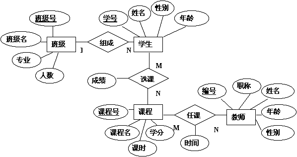

<h1 align="middle">数据库原理</h1>

<div align="right">最近更新时间：2024-01-04</div>

## 关系型数据库理论

**数据库分类**：关系型数据库（如MySQL）、非关系型数据库（如Redis）

### 三要素

| 三要素    | 内容                          |
|:------:|:---------------------------:|
| 关系数据结构 | 二维表                         |
| 关系操作   | 增删改查（关系代数语言，关系演算语言，综合性的SQL） |
| 完整性约束  | 实体完整性、参照完整性、自定义完整性          |

| 要素一：关系数据结构术语 | 说明                   |
|:------------:|:--------------------:|
| 关系模式         | 表格的表头                |
| 域、属性         | 表格的列                 |
| 关系、元组        | 表格的内容行               |
| 码            | 由一个或多个属性构成，能唯一标识每个元组 |
| 候选码          | 所有符合条件的码             |
| 主码、主键        | 从候选码中，选出的1个          |

| 要素二：关系操作术语 | 说明                                  |
|:----------:|:-----------------------------------:|
| 关系代数语言     | 查询操作时是**集合操作**为基础运算的语言              |
| 关系演算语言     | 查询操作是以**谓词演算**为基础运算的语言              |
| 综合性的SQL    | 综合关系代数语言、关系演算语言特点的DDL、DML、DQL、DCL语言 |

| 要素三：完整性约束术语 | 说明                    |
|:-----------:|:---------------------:|
| 实体完整性       | 关系中不能有完全相同的元组         |
| 参照完整性       | 参照的所有属性及内容，必须是被参照表所有的 |
| 自定义完整性      | 自定义的取值限制              |

| 关系代数表示               | 说明                             |
|:--------------------:|:------------------------------:|
| 交$\cap$、并$\cup$、差$-$ | 集合基础运算                         |
| 笛卡尔积$×$              | 不同表的所有组合                       |
| 投影$\pi$              | 只显示某列，同SELECET...              |
| 选择$\sigma$           | 选择符合条件的，同WHERE...              |
| 重命名$\rho$            | 重命名，同AS...                     |
| 辅助运算符                | 比较运算符$><=$、逻辑运算符$\vee \wedge-$ |

---

### ER图

**概念**：实体联系图，用来建立数据模型

| ER图三要素 | 表示  | 说明       |
|:------:|:---:|:--------:|
| 实体型    | 矩形  | \        |
| 属性     | 椭圆形 | 主属性下划线   |
| 联系     | 菱形  | 两端写上关系类型 |

- **关系类型**：1:1型，n:1型，n:m型



---

### UML图

| 分类  | 说明                   |
|:---:|:--------------------:|
| 例图  | 用户角度，指定各功能的操作者       |
| 静态图 | 包括类图、对象图、聚合等         |
| 行为图 | 描述动态模型和组成对象间的交互关系    |
| 交互图 | 描述对象间的交互关系           |
| 实现图 | 各代码部件物理结构和各部件之间的依赖关系 |

---

### 规范化理论

**概念**：通过分解改造逻辑模型的关系模式。

| 术语      | 表示                                 | 说明             | 例          |
|:-------:|:----------------------------------:|:--------------:|:----------:|
| 函数依赖    | $A→B$                              | 每个A值都有唯一B值与之对应 | \          |
| 完全函数依赖  | $A\quad\underrightarrow{f}\quad B$ | B值依赖于全部A值      | 学号→选课      |
| 部分函数依赖  | $A\quad\underrightarrow{p}\quad B$ | B值依赖于A值的真子集    | (学号,姓名)→选课 |
| 传递函数依赖  | $A→B，且B→C$                         | $A→C$是传递依赖     | 学号→选课→教师   |
| 非平凡函数依赖 | $A→B，且B⊄A$                         | B值依赖且非来源于A值    | 学号→选课      |
| 平凡函数依赖  | $A→B，且B⊆A$                         | B值依赖且来源于A值     | 学号→同桌      |

| 范式        | 说明               |
|:---------:|:----------------:|
| 第一范式，1NF  | 关系模式不可直接再分       |
| 第二范式，2NF  | 消除非主属性的部分函数依赖    |
| 第三范式，3NF  | 消除非主属性的传递函数依赖    |
| BC范式，BCNF | 消除主属性的部分和传递函数依赖  |
| 第四范式，4NF  | 消除非平凡且非函数依赖的多值依赖 |
| 第五范式，5NF  | 消除不是由候选码所蕴含的连接依赖 |

- 恢复时与分解前的数据保持一致，分解后函数依赖保持不变。

---

## SQL基础语法

### DDL

**概念**：date description language数据描述语言，用以数据库和表格的增删改查。

#### 数据库DDL

```sql
create database 数据库名;

use 数据库名;

drop 数据库名;
```

---

#### 表格DDL

```sql
create table 表名(
    属性名1 数据类型,
    属性名2 数据类型 完整性约束 完整性约束...,
    ...,
    表格完整性约束(属性名1,属性名2,...)
);

alter table 表名 add 属性名 数据类型 完整性约束;

alter table 表名 drop column 属性名;

alter table 表名 drop 完整性约束(属性名);

alter table 表名 add 完整性约束(属性名);

alter table 表名 modify 属性名 数据类型 完整性约束;

alter table 表名 rename to 新表名;

drop table 表名;
```

| 数据类型         | 说明                      |
|:------------:|:-----------------------:|
| tinyint      | 1B整数                    |
| smallint     | 2B整数                    |
| mediumint    | 3B整数                    |
| int          | 4B整数                    |
| bigint       | 8B整数                    |
| int unsigned | 无符号4B整数                 |
| float        | 单精浮点数                   |
| double       | 双精浮点数                   |
| real         | 默认double                |
| decimal(M,D) | 定点数                     |
| bit(M)       | 二进制，比特数                 |
| binary(M)    | 二进制，字节数                 |
| varbinary(M) | 可变二进制，字节数               |
| blob(M)      | 二进制大对象，存图片、音频等文件的二进制数据流 |
| year         | 表示YYYY                  |
| data         | 表示YYYY-MM-DD            |
| datatime     | 表示YYYY-MM-DD HH:MM:SS   |
| timestamp    | 从1970年1月1日8点开始的时间戳      |
| char(M)      | 字符型                     |
| varchar(M)   | 可变字符型                   |
| enum         | 枚举型                     |
| set          | 集合型                     |
| json         | json字符串                 |

| 完整性约束              | 说明       |
|:------------------:|:--------:|
| primary key        | 主键       |
| not null           | 非空限制     |
| unique             | 唯一限制     |
| check(属性名<=56)     | 取值限制     |
| auto_increment=初始值 | 自动按初始值自增 |

---

### DQL

**概念**：data query language，数据查询语言，对表格中元组实例的查询操作。

#### 单表DQL

```sql
select distinct 属性名1 as 属性别名,属性名2,属性名3...
from 表名
where 筛选条件
group by 属性名
having 分组条件
order by 属性名 desc,属性名...
limit 结果展示起始行,每页展示数;
```

| 可省略关键词   | 意义            |
|:--------:|:-------------:|
| distinct | 结果去重          |
| as       | 属性起别名         |
| desc     | 改降序           |
| from     | 元组筛选条件        |
| group by | 以某属性名分组       |
| having   | 筛选可分组的属性名     |
| order by | 以多级属性为比对，进行排序 |
| limit    | 单页展示          |

| 条件辅助关键词 | 说明                          |
|:-------:|:---------------------------:|
| and     | 与                           |
| or      | 或                           |
| not     | 非                           |
| xor     | 异或                          |
| between | 在...之间                      |
| in      | 符合集合中的任一个                   |
| like    | 模糊匹配：多位%    单位_    除了ESCAPE |

---

#### 多表DQL

```sql
select * from 表一,表二;    //笛卡尔积，隐式内连接

select 表一.属性名,表二.属性名
from 表一,表二
where 等值条件;    //等值连接，隐式内连接

select 表一.属性名,表二.属性名
from 表一 join 表二 on 等值条件
where 筛选条件;    //显示内连接

select 表一.属性名,表二.属性名
from 表一 left join 表二 on 等值条件
where 筛选条件;    //显示左连接

select 表一.属性名,表二.属性名
from 表一 right join 表二 on 等值条件
where 筛选条件;    //显示右连接
```

---

#### 嵌套DQL

```sql
select * from 表名 where 属性名 = (标量子查询DQL语句);

select * from 表名 where 属性名 in (列子查询DQL语句);

select * from 表名 where (属性名,属性名) = (行子查询DQL语句);

select * from （表子查询DQL语句） where 条件;

(子查询DQL语句) UNION (子查询DQL语句)    //并集
```

---

### DML

**概念**：data manipulation language，数据操作语言，对表格元组的增删改操作。

```sql
insert into 表名 (属性名1,属性名2,...) values (值1,值2...);

update 表名 set 属性名=值 where 条件;

delete from 表名 where 条件; 

truncate 表名;    //相当于drop后create，速度比delete块。
```

---

### DCL

**概念**：data control language，数据控制语言，用户管理，权限管理等安全性操作

```sql
create user '用户名'@'主机名'    //主机名可用%，进行模糊匹配
identified by 密码;

alter user '用户名'@'主机名'
identified with mysql_native_password by 新密码;

drop user '用户名'@'主机名';

show grant for '用户名'@'主机名';

grant 权限,权限(属性名)...
on table 名
to '用户名'@'主机名'
with grant option;    //可选，被授予者可以授予其他人

revoke 权限,权限(属性名)...、
on table 表名
from '用户名'@'主机名';
```

| 权限                             | 说明        |
|:------------------------------:|:---------:|
| replication slave              | 全部权限      |
| insert、delete、updata、select... | 个别增删改查等权限 |

---

## SQL扩展语法

### 视图

**概念**：依据查询结果创建视图，可以提高数据的安全性、独立性。

```sql
create view 视图名 as DQL语句;

create view 视图名 as DQL语句 with check option;    //更新，保持一致

create view 视图名 as DQL语句 with local check option;    //多级视图不传递

create view 视图名 as DQL语句 with cascaded check option;//多级视图更新传递---
```

### 索引

**概念**：建立索引可以提高SQL语句执行速度，索引是B+树结构。

```sql
create index 索引名 on 表名(属性名 desc,属性)

create index 索引名 on 表名(属性名(前缀数)) //前缀索引

show index from 表名;

drop index 索引名 on 表名;
```

| 术语          | 说明                          |
| ----------- | --------------------------- |
| 聚簇索引cluster | 自动在主键建立，叶子结点是一行的全部数据，无需回表查询 |
| 辅助索引        | 叶子结点只有主键的值，可能需要回表查询         |

- 回表查询：在辅助索引找不到全部所需数据，而再到聚簇索引进行查找

- 覆盖查询：无需回表，建立索引的1-n个属性名已经包含全部所需数据。

- 联合索引：对多个属性联合建立索引

| 索引失效           |
| -------------- |
| 在索引列上进行运算操作    |
| 字符串不加单引号       |
| 头部使用模糊查询       |
| or连接的两端有一端没有索引 |
| 当前查询的数据占绝大部分   |

- 联合索引的**最左前缀法则**：跳过最左属性，索引全部失效，跳过中间属性，索引部分失效，用> <部分失效，用>= <=不会失效。

| SQL提示             | 说明            |
| ----------------- | ------------- |
| use index(索引名)    | **建议**使用某索引查询 |
| ignore index(索引名) | **忽视**某索引查询   |
| force index(索引名)  | **强制**使用某索引查询 |

- 用在DQL的from 表名后面。

---

### 变量

```sql
show session variables;    //系统变量，查看全部局部
show global variables;    //系统变量，查看全部全局

show global variables like 模糊匹配词;    //系统变量，模糊匹配

show @@global.变量名;    //系统变量，具体查询

set global 变量名 = 值;    //系统变量，赋值

set @变量名 = 值;    //用户变量，定义赋值

declare 变量名 变量类型 default 默认值;    //局部变量，定义

set 变量名 = 值;    //局部变量，赋值
```

---

### 游标

```sql
declare 游标名 cursor for DQL语句;

open 游标名;

fetch 游标名 into 1到n个变量;

close 游标名;
```

---

### 存储过程

```sql
create procedure 过程名(出进类型 形参 变量类型)
begin
    过程体;
end;

call 过程名();

show create procedure 过程名;

show * from information_schema.routines where routines_schema = '表名';
```

- 命令行写的话需要定义结束符：delimiter $

- 出进类型：进in、出out、出进inout

---

### 存储函数

```sql
create function 函数名(形参 变量类型) returns 变量类型 deterministic
begin
    函数体;
return 返回值;
end;

call 函数名();
```

---

### SQL函数

| 字符串函数                    | 说明           |
|:------------------------:|:------------:|
| concat(str1,str2,...)    | 字符串拼接        |
| lower(str)               | 全转小写         |
| upper(str)               | 全转大写         |
| lpad(str,n,pad)          | 左填充pad至总n个字符 |
| rpad(str,n,pad)          | 右填充pad至总n个字符 |
| trim(str)                | 去除首尾空格       |
| substring(str,start,len) | 截取字符串        |

| 数学函数       | 说明       |
|:----------:|:--------:|
| ceil(n)    | 向上取整     |
| floor(n)   | 向下取整     |
| mod(n,m)   | n%m      |
| rand()     | 生成0-1随机数 |
| round(n,m) | 保留m为小数   |

| 日期函数                           | 说明            |
|:------------------------------:|:-------------:|
| curdata()                      | 获取当前年月日       |
| curtime()                      | 获取当前时间        |
| now()                          | 获取当前的年月日时间    |
| year(data)                     | 获取指定data的YYYY |
| month(data)                    | 获取指定data的MM   |
| day(data)                      | 获取指定data的DD   |
| data_add(data,interval 70 day) | 计算data70天前的日期 |
| datadiff(data1,data2)          | 获取间隔天数，前减后    |

| 流程函数                  | 说明                        |
|:---------------------:|:-------------------------:|
| if(value,t,f)         | 三目运算符                     |
| ifnull(value1,value2) | 判空value1，非空value1，空value2 |

---

### 判断语句

```sql
if 条件 
    then 内容;
    elseif 条件 then 内容;
end if;

case
    when 条件 then 值;
    when 条件 then 值;
end case;
```

---

### 循环语句

```sql
while 条件
    do 循环体;
end while;

repeat 循环体;
until 条件 end repeat;

名称:loop 循环体;
end loop 名称;
```

+ leave：退出循环break，iterate：进入下轮循环continue

---

### 触发器

```sql
create trigger 触发器名 before SQL关键字 on 表名 for each row
begin
    触发器体;
end; 

show trigger;

drop trigger 触发器名;
```

+ before之前，after之后

+ sql关键字：insert、delete、updata、select...

+ 是日志原理

---

## 性能分析

查询当前数据库各操作频率

```sql
show global status like 'com_______';    //7为数占位符
```

- status：系统状态，variables：sql系统变量

慢查询日志

```sql
set slow_query_log = 1;    //打开慢查询日志
set long_query_time = 2;    //长查询时间达到几s，记入日志
```

查看所有语句耗时

```sql
select @@have_profiling;    //是否支持profiles
select @@profiling;    //查询profiles参数
set profiling = 1;    //打开profiles

show profiles;
show profiles for query 序号;
show profiles cpu for query 序号;
```

查看执行计划

```sql
explain 被分析语句;
```

---

## 事务

### 事务特性

| 事务特性 | 表示  |
|:----:|:---:|
| 原子性  | A   |
| 一致性  | C   |
| 隔离性  | I   |
| 持久性  | D   |

+ ACD实现依赖于重做日志redo log，撤销日志undo log

---

### 事务过程

```sql
start transaction;    //事务开始

begin;    //同上

commit;    //事务提交

rollback;    //事务回滚
```

---

### 事务并发问题

| 事务并发执行产生问题 | 说明               |
|:----------:|:----------------:|
| 脏读         | 读到其他事务未提交的数据     |
| 不可重复读      | 同一事务，两次查询数据不同    |
| 幻读         | 查的时候没有，插入却有而无法插入 |

---

### 事务隔离与MVCC

**概念**：通过事务隔离，解决并发问题

```sql
select @@transaction_isolation;

set global transaction isolation level 隔离级别;

set session transaction isolation level 隔离级别;
```

| 隔离级别             | 解决          | 性能  |
|:----------------:|:-----------:|:---:|
| read uncommitted | \           | 高   |
| read committed   | 脏读          | 较高  |
| repeatable read  | 脏读、不可重复读    | 较低  |
| serializable     | 脏读、不可重复度、幻读 | 低   |

+ 可重复读依赖于，在第一次读时，生成的快照读文件

+ 事务隔离中read committed、repeatable read底层原理是MVCC

---

**MVCC概念**：多版本并发控制，维护一个数据多个版本，使读写没有冲突。

**基于**：undolog、版本链、readview


| readview记录内容   | 说明           |
|:--------------:|:------------:|
| m_ids          | 活跃事务id       |
| min_trx_id     | 活跃事务中的最小事务id |
| max_trx_id     | 活跃事务的下一个事务id |
| creator_trx_id | 本事务id        |

| 读写控制判断                           | 控制内容               |
|:--------------------------------:|:------------------:|
| trx_id == creator_trx_id         | 可访问此版本             |
| trx_id < min_trx_id              | 可访问此版本             |
| trx_id > max_trx_id              | 不可访问此版本            |
| min_trx_id < trx_id < max_trx_id | 若在m_ids中不可访问，否则可访问 |

---

### 封锁

**概念**：事务执行操作时，对表加锁，解决并发问题

| 两种锁 | 简记  | 别名  | 允许其他事务一起 | 禁止其他事务一起 | 可叠加锁 |
|:---:|:---:|:---:|:--------:|:--------:|:----:|
| 排它锁 | X   | 写锁  | \        | 读、写      | \    |
| 共享锁 | S   | 读锁  | 读        | 写        | S    |

| 三级封锁协议 | 基础   | 何时加锁 | 加什么锁 | 何时释放 | 解决问题     |
|:------:|:----:|:----:|:----:|:----:|:--------:|
| 1级封锁协议 | \    | 写    | X    | 写完   | \        |
| 2级封锁协议 | 1级封锁 | 读    | S    | 读完   | 脏读       |
| 3级封锁协议 | 1级封锁 | 读    | S    | 事务完成 | 脏读、不可重复读 |

+ 两段锁协议：事务开始到提交前都是加锁阶段，只能叠加锁，事务提交时属于解锁阶段，不能再进叠加锁操作。

```sql
flush tables with read lock;    //全局加共享锁

unlock tables;    //全局解共享锁

lock table 表名 read;    //表加共享锁

lock table 表名 write;    //表加排他锁

DQL语句 lock in share mode    //行加共享锁查询

DQL语句 for share    //行加共享锁查询

DQL语句 for update    //行加排它锁查询
```

+ 根据锁的范围分类：全局锁、表锁、行锁、间隙锁

---

## 客户端指令

**概念**：在命令行的工作目录下执行的语句。

```sql
mysql -h 主机 -P 3306 -u 用户名 -p 密码 数据库名 -e 'SQL语句'

mysqladmin --help

mysqladmin -u 用户名 -p 密码 create 数据库名

mysqlshow -u 用户名 -p 密码 数据库名 --count -i

mysqlimport -u 用户名 -p 密码 数据库名 txt文件路径

//备份
mysqldump --single-transaction -u用户名 -p密码 数据库名 > 路径

//备份文件导入，在sql内的，数据库下执行的语句
source 路径
```

---

## 故障与备份

故障分类：事务故障、系统故障、介质故障

从什么地方恢复：转储/备份、日志文件转储分类：静态转储、动态转储、海量转储、增量转储

数据库复制分类：对等复制，主从复制，级联复制

数据库镜像：关键数据复制，能实现同时读写

---

### 日志

| 分类    | sql变量          | 记录情况 |
|:-----:|:--------------:|:----:|
| 错误日志  | log_error      | 执行错误 |
| 二进制日志 | log_bin        | 所有变化 |
| 查询日志  | general_log    | 查询   |
| 慢查询日志 | slow_query_log | 慢执行  |

---

### 主从配置

防火墙配置

```sql
//Linux开放防火墙端口
firewall -cmd --zone=public --add-port=3306/tcp --permanent
firewall -cmd --reload

//Linux直接关闭防火墙
systemctl stop firewalld

systemctl disabled firewalld

//Linux查看mysql进程状态
systemctl statue mysqld
```

主库配置

```sql
//Linux文件/etc/my.cnf下配置增加
server-id＝1
read-only＝0
//Linux重启mysql服务器
systemctl restart mysqld
//sql创建远程连接用户，授权，查看坐标
create user '用户名'@'%' indentified with mysql_native_password by '密码';
grant replication slave on *.* to '用户名'@'%';
//Linux查看主库状态
show master statue
```

从库配置

```sql
//Linux文件/etc/my.cnf下配置增加
server-id＝2
read-only＝1
//Linux重启mysql服务器
systemctl restart mysqld
/Linux连接主库，开启同步
change source to source_host/_user/_password/_log_file/_log_pos
start replica
//Linux查看从库状态
show replica statue
```

---

## 分库分表

**概念**：一个数据库的数据分布在多个服务器

| 分类   | 说明，      |
|:----:|:--------:|
| 垂直分片 | 以表为分片依据  |
| 水平分片 | 以元组为分片依据 |

+ 可使用**Mycat**：用java编写的MySQL中间件
