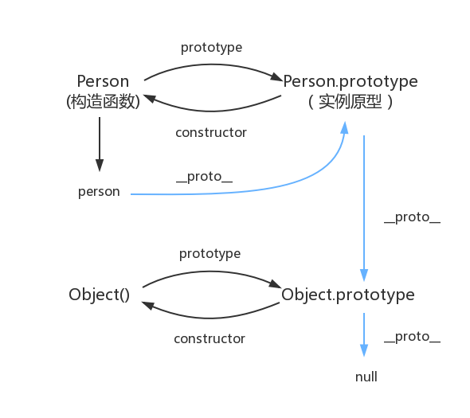

<h1 align="center">JavaScript</h1>

## 介绍

|         | 内容                             |
|:-------:|:------------------------------:|
| 语言类型    | 解释型、事件驱动型、脚本编程语言               |
| 解释器/编译器 | 解释器：V8引擎                       |
| 运行平台    | 浏览器、nodejs                     |
| 集成开发环境  | 推荐VScode                       |
| 书写位置    | js文件、嵌入html文件                  |
| 组成      | ECMAscript基础语法、Web APIs、第三方模块包 |
| API文档   | MDN官方文档、Lodash官方文档             |

+ 脚本：以普通文本形式保存。

+ API：应用程序编程接口，提供封装了特定功能的函数、方法、类、对象等。

| 嵌入html文件三种方式 | 语法                                  |
|:------------:|:-----------------------------------:|
| html内部       | `<script> js代码块 </script>`          |
| html外部       | `<script src=“js文件”></script>`      |
| html行内       | `<button onclick="js代码行"></button>` |

---

## 输入和输出

| 输出位置  | 语法                                  |
|:-----:|:-----------------------------------:|
| 终端    | `console.log(输出)`和`console.dir(输出)` |
| 浏览器页面 | `document.write(输出)`                |
| 浏览器弹框 | `alert(输出)`                         |

| 输入位置  | 语法                    |
|:-----:|:---------------------:|
| 浏览器弹框 | `let 接收 = prompt(提示)` |

---

## 变量和常量

| 声明          | 推荐  |
|:-----------:|:---:|
| `let 变量`    | √   |
| `const 常量`  | √   |
| `变量`        |     |
| `var 变量`    |     |
| `window.属性` |     |

| 特性     | 说明                           |
|:------:|:----------------------------:|
| 命名规则   | 区分大小写、允许下划线/数字/英文/中文、不能数字开头  |
| 命名规范   | 下划线命名法、小驼峰命名法、大驼峰命名法         |
| 作用域链   | 从当前作用域开始，往父级作用域方向形成链条，就近原则使用 |
| 垃圾回收机制 | 采用引用计数法：从根作用域出发找不到该变量时释放     |
| 闭包     | 内层函数使用外层变量                   |
| 变量提升   | 使用var声明的变量有提升，能将声明提到其作用域开头   |
| 弱数据类型  | 声明时，无需指明数据类型                 |

## 数据类型

<table style="text-align:center;">
    <tr>
        <th>类别</th><th>数据类型</th><th>表示</th>
    </tr>
    <tr>
        <td rowspan="3">基础</td><td>数字型</td><td>Number</td>
    </tr>
    <tr>
        <td>字符型</td><td>String</td>
    </tr>
    <tr>
        <td>布尔型</td><td>Boolean</td>
    </tr>
    <tr>
        <td rowspan="2">复合</td><td>数组</td><td>Array</td>
    </tr>
    <tr>
        <td>对象</td><td>Object</td>
    </tr>
    <tr>
        <td rowspan="5">特殊</td><td>空</td><td>null</td>
    </tr>
    <tr>
        <td>未定义</td><td>undefined</td>
    </tr>
    <tr>
        <td>不是数</td><td>NaN</td>
    </tr>
    <tr>
        <td>函数</td><td>function</td>
    </tr>
    <tr>
        <td>类</td><td>class</td>
    </tr>
</table>

+ 查看数据类型：`typeof(变量)`或`typeof 变量`

| 特殊运算              | 结果      | 说明                      |
|:-----------------:|:-------:|:-----------------------:|
| `null+4`          | `4`     | null本质是0                |
| `''-4`            | `-4`    | ’‘本质是null               |
| `null==undifined` | `true`  | null和undifined类型相同      |
| `undifined+4`     | `NaN`   | undifined本质不是0          |
| `NaN===NaN`       | `false` | NaN本质是不同类型加数字，得到的无意义机器码 |

---

### 类型转换

| 隐式转换  | 语法               | 被转对象    | 原类型 | 转换为 |
|:-----:|:----------------:|:-------:|:---:|:---:|
| 字符串拼接 | `'今天是'+2023+'年'` | 2023    | 数字型 | 字符型 |
| 比较    | `2 == '2'`       | '2'     | 字符型 | 数字型 |
| 运算    | `'3'-'2'`        | '3'，'2' | 字符型 | 数字型 |
| 开头转换符 | `+'65'`          | '65'    | 字符型 | 数字型 |

| 显示转换                    | 结果    |
|:-----------------------:|:-----:|
| `Number('15')`          | 15    |
| `parseInt('15.34px')`   | 15    |
| `parseFloat('15.34px')` | 15.34 |

---

## 符号

| 分类         | 符号                                                        |
|:----------:|:---------------------------------------------------------:|
| 算数运算符（值运算） | 加+    减-    乘*    除/    幂**                               |
| 算数运算符（位运算） | 左移<<    右移>>    右移>>>                                     |
| 一元运算符      | 自增++    自减--                                              |
| 赋值运算符      | 赋值=    运算赋值+=                                             |
| 比较运算符      | 值等===    值不等!==    类型等==    类不等!=<br>比较>    <    >=    <= |
| 逻辑运算符      | 与&&    或\|                                                |
| 转义字符       | 转义\                                                       |
| 代码行结束符     | 结束;                                                       |
| 成员访问符      | 成员.    可选成员?.                                             |
| 字符串拼接符     | 拼接+                                                       |
| 注释符        | //单行注释    /\*多行注释\*/                                      |
| 展开运算符      | 展开...                                                     |

+ 结束符可省略不写

---

## 判断语句

**逻辑中断**

```javascript
左部分 && 右部分    //一假则假，左部分返回假，不再运行右部分
左部分 || 右部分    //一真则真，左部分返回真，不再运行右部分
```

**if语句**

```javascript
if(条件){
    执行内容
}else if(条件){
    执行内容
}else{
    执行内容
}
```

**三目运算符**

```javascript
条件?真执行:假执行
```

---

## 循环语句

**while语句**

```javascript
while(条件){
    循环体
}
```

**for语句**

```javascript
for(变量初始;条件;变量变化){
    循环体
}
```

**增强for：常用于对象的遍历**

```javascript
for(取自数据容器 in 数据容器){
    执行内容
}
```

+ 当数据容器是数组时，取下标，转字符串，少用，一般用foreach()方法

+ 当数据容器是对象时，取下标，转字符串，搭配`对象[字符串下标]`使用

| 循环体控制关键字   | 意义     |
|:----------:|:------:|
| `break`    | 打破整个循环 |
| `continue` | 打破本轮循环 |

---

## 类与对象

### 类

**类声明**

```javascript
class 类名{
    constructor(形参,形参) {
        this.属性 = 形参    //属性的定义，赋值
        this.属性 = 形参
    }
    方法(){方法体}    //方法的定义
    static 方法(){方法体}    //静态方法
}
```

**类的实例化**

```javascript
let 对象 = new 类名()  
```

**类继承**

```javascript
class 子类 extends 父类{
    类定义
}
```

+ 类：用于批量生产对象

+ 父类：用于批量生产类，做顶层设计

| 两种成员 | 说明                 | 语法        |
|:----:|:------------------:|:---------:|
| 实例成员 | （大部分只能）实例对象直接访问    | `实例对象.成员` |
| 静态成员 | 只能用类名访问，不能在实例对象上访问 | `类.成员`    |

---

### 构造函数

**构造函数声明**

```javascript
function 构造函数名(name,age,gender){
    this.属性 = 初始值
    this.属性 = 初始值
    this.方法 = 匿名函数
}
```

**构造函数的实例化**

```javascript
let 对象 = new 构造函数名() 
```

**原型继承**

```javascript
子构造函数.prototype = new 父构造函数()
子构造函数.prototype.constructor = 父构造函数
```

+ 构造函数：用于批量生产对象

+ 父构造函数：用于批量生产构造函数，做顶层设计

+ 原型对象`prototype`：构造函数才有，存共有的实例属性和方法，节省存储空间

+ 对象原型`__proto__`：实例对象，原型对象才有，形成原型链的指针

+ js中万物皆对象，所有对象的原型链终点，都是Object的原型对象。



---

### 对象类Object

**对象声明：符号实例化**

```javascript
let 对象 = {
    属性:值,
    属性:值,
    方法:匿名函数,
    方法:匿名函数,
}
```

**对象声明：new函数实例化**

```javascript
let 对象 = new Object();    //空对象
对象.属性 = 值    //特性：有就改，没有就增加
对象.方法 = 匿名函数
```

**成员访问**

```javascript
对象.属性
对象['属性']
对象.方法()
```

**成员删除**

```javascript
delete 对象.成员
```

**展开运算**：`...对象`，相当于把对象的{}去除

**对象解构**：把对象各value值批量赋值给变量的语法

| 对象解构    | 语法                               |
|:-------:|:--------------------------------:|
| 基础语法    | `const {变量,变量,变量} = 对象`          |
| 重命名变量语法 | `const {变量:新名,变量:新名,变量:新名} = 对象` |
| 对象嵌套解构  | `const {变量,变量,对象:{变量,变量}} = 对象`  |

+ 变量必须同属性名

| Object的静态方法               | 说明                   |
|:-------------------------:|:--------------------:|
| `Object.keys(对象)`         | 获取对象所有属性的key，返回数组    |
| `Object.values(对象)`       | 获取对象所有属性的value，返回数组  |
| `Object.assign(对象,被拷贝对象)` | 属浅拷贝，给对象追加另一对象的属性和方法 |

---

### 函数类

**普通函数声明**

```javascript
function 函数名(形参){
    函数体
    return 返回值
}
```

**匿名函数声明**

```javascript
function(形参){
    函数体
    return 返回值
}
```

**箭头函数声明**

```javascript
(形参)=>{
    函数体
    return 返回值
}

()=>返回值    //省略写法
```

| 特殊参数 | 形参语法                  | 说明                     |
|:----:|:---------------------:|:----------------------:|
| 默认参数 | `(默参=默认值)`            | 设定默认值                  |
| 回调函数 | `(回调函数)`              | 传入是函数                  |
| 动态参数 | `()`                  | 无形参，用函数私有属性`arguments` |
| 剩余参数 | `(形参,形参,...剩参)`       | 接受多出的所有参数封装为数组         |
| 解构参数 | `([变量,变量],{key,key})` | 分别传入`数组`和`对象`          |

+ 终极理解：`形参语法 = 传参语法`

+ 传多传少：传多忽略、传少默认或undefined

+ 传递类型：简单数据类型值传递，复杂数据类型地址传递

+ 函数调用：`函数名()`

+ 立即执行：`(函数体)();`或`(函数体());`

| 函数this指针的指向 | 指向     |
|:-----------:|:------:|
| 一般函数        | window |
| 构造函数        | 调用者    |
| 对象方法        | 对象     |
| 事件回调函数      | 绑定事件对象 |

| 函数实例方法改变this指针 | 说明                     |
|:--------------:|:----------------------:|
| `call(对象)`     | 让本函数this指向该对象，然后调用函数   |
| `apply(数组对象)`  | 让本函数this指向该数组对象，然后调用函数 |
| `bind(对象)`     | 让本函数this指向该对象，但不调用函数   |

---

### 数组类Array

**数组声明：符号实例化**

```javascript
let 数组 = [元素1,元素2,元素3]
```

**数组声明：new函数实例化**

```javascript
let 数组 = new Array(元素1,元素2,元素3)
```

**成员访问**

```javascript
数组[数字下标]    //下标从0开始
```

**展开运算**：`...数组`，相当于把数组的[]去除

**数组解构**：把数组各value值批量赋值给变量的语法

| 数组解构      | 语法                      |
|:---------:|:-----------------------:|
| 基础语法      | `const [变量,变量,变量] = 数组` |
| 忽略第2个变量语法 | `const [变量,,变量] = 数组`   |

+ 传多传少：传多忽略，传少默认或undefined

+ （技巧）交换变量：`;[变量2,变量1]=[变量1,变量2] `，上句分号很重要

| 数组实例属性   | 返回  |
|:--------:|:---:|
| `length` | 长度  |

| 数组实例方法                                     | 作用     | 返回  |
|:------------------------------------------:|:------:|:---:|
| `push(元素,元素)`                              | 尾部新增   | 长度  |
| `unshift(元素,元素)`                           | 头部新增   | 长度  |
| `pop()`                                    | 删除尾部   | 元素  |
| `splice(起始下标,删除个数)`                        | 删除一段   | \   |
| `findIndex(元素)`                            | 找下标    | 下标  |
| `sort()`                                   | 升序排序   | \   |
| `sort(function(a,b){return b-a})`          | 降序排序   | \   |
| `join('连接符')`                              | 元素拼接   | 字符串 |
| `reverse()`                                | 反转数组   | \   |
| `fill(替换元素,起下标,终下标不包括)`                    | 元素批量替换 |     |
| `concat(数组)`                               | 合并数组   | 新数组 |
| `map(function(ele,ind){return 重写体})`       | 重写各元素  | 新数组 |
| `forEach(function(ele,ind){操作})`           | 遍历操作   | \   |
| `filter(function(ele,ind){return 筛选条件})`   | 筛选元素   | 新数组 |
| `reduce(function(上次值,ele){return 累操作},初始)` | 累操作    | 最终值 |
| `find(function(ele,ind){return 寻找条件})`     | 寻找元素   | 元素  |
| `findIndex(function(ele){return 寻找条件})`    | 寻找索引值  | 下标  |
| `every(function(ele,ind){return 判断条件})`    | 都符合条件? | 布尔值 |
| `some(function(ele,ind){return 判断条件})`     | 有符合条件? | 布尔值 |

| 数组静态方法              | 作用       | 返回  |
|:-------------------:|:--------:|:---:|
| `Array.from(伪数组)`   | 将伪数组转为数组 | 新数组 |
| `Array.isArray(数组)` | 是否为数组    | 布尔值 |

---

### 字符串类String

**字符串声明：符号实例化**

```javascript
let 字符串 = '内容'
let 字符串 = "内容"
let 字符串 = `内容`
let 字符串 = `内容${变量}内容`    \\模板字符串
```

**字符串声明：new函数实例化**

```javascript
let 字符串 = new String()
```

| 字符串实例属性  | 返回  |
|:--------:|:---:|
| `length` | 长度  |

| 字符串实例方法                 | 作用           | 返回   |
|:-----------------------:|:------------:|:----:|
| `trim()`                | 去除首尾空格       | \    |
| `split('分隔符')`          | 把字符串按分隔符拆分   | 数组   |
| `substring(起下标,终下标不包括)` | 字符串截取        | 字符串  |
| `slice(起下标,终下标不包括)`     | 字符串截取吗，支持负下标 | 字符串  |
| `startsWith(字符串,开始位置)`  | 是否以某字符串开头    | 布尔值  |
| `includes(字符串)`         | 是否包含字符串      | 布尔值  |
| `match(正则表达式)`          | 返回符合匹配的结果    | 数组   |
| `replace(正则表达式，替换字符)`   | 替换字符串        | 新字符串 |
| `chatAt(下标)`            | 按下标找字符       | 字符   |
| `toUpperCase()`         | 全转大写         | \    |
| `toLowerCase()`         | 全转小写         | \    |

---

### 数字类Number

**数字声明**

```javascript
let 数字 = new Number(`5685`)
let 数字 = 5685
```

| 数字实例方法        | 作用     | 返回  |
|:-------------:|:------:|:---:|
| `toFixed(位数)` | 保留几位小数 | 新数字 |

---

### 数学类Math

| 数学静态属性    | 返回  |
|:---------:|:---:|
| `Math.PI` | 圆周率 |

| 数学静态方法               | 作用          | 返回  |
|:--------------------:|:-----------:|:---:|
| `Math.ceil(数值)`      | 向上取整        | 数字  |
| `Math.floor(数值)`     | 向下取整        | 数字  |
| `Math.round(数值)`     | 四舍五入        | 数字  |
| `Math.abs(数值)`       | 求绝对值        | 数字  |
| `Math.max(数值,数值,数值)` | 求最大值        | 数字  |
| `Math.random()`      | 取[0,1)的随机小数 | 数字  |

+ 四舍五入往值大的入，不是往绝对值大的入：1.5≈2，-1.5≈-1

+ 取a-b的整数：`Math.floor(Math.random()*整数个数(b-a+1)+从0开始偏移量a)`

---

### 时间类Date

**时间声明**

```javascript
let 时间 = new Data()
```

| 时间实例方法                 | 作用                     | 返回  |
|:----------------------:|:----------------------:|:---:|
| `getFullYear()`        | 获取4位数年份                | 数字  |
| `getMonth()`           | 获取0-11的月份              | 数字  |
| `getDate()`            | 获取日期                   | 数字  |
| `getDay()`             | 获取0-6的星期，星期天是0         | 数字  |
| `getHours()`           | 获取0-23时                | 数字  |
| `getMinutes()`         | 获取0-59分                | 数字  |
| `getSeconds()`         | 获取0-59秒                | 数字  |
| `toLocaleString()`     | 格式化为2001/2/2 15\:00:00 | 字符串 |
| `toLocaleDataString()` | 格式化为2001/2/2           | 字符串 |
| `toLocaleTimeString()` | 格式化为15\:00:00          | 字符串 |
| `getTime()`            | 获得其时间戳                 | 数字  |

| 时间静态方法       | 作用      | 返回  |
|:------------:|:-------:|:---:|
| `Data.now()` | 获得当前时间戳 | 时间戳 |

+ 时间戳：获得从1970年1月1日8点到现在的毫秒数，数字型，用于制作倒计时

---

### JSON类JSON

| JSON静态方法              | 作用          | 返回      |
|:---------------------:|:-----------:|:-------:|
| `JSON.stringify(对象)`  | 将对象转JSON字符串 | JSON字符串 |
| `JSON.parse(JSON字符串)` | 将JSON字符串转对象 | 对象      |

---

### 正则类RegEep

**正则声明**

```javascript
let 正则 = new RegExp(/表达式/修饰符)
let rule = new RegExp(/^[1-9][0-9]{5,}$/)    //必须6位数字，不能0开头
```

| 正则实例方法         | 作用   | 返回  |
|:--------------:|:----:|:---:|
| `text(被查找字符串)` | 是否匹配 | 布尔值 |
| `exec(被查找字符串)` | 是否匹配 | 数组  |

<table style="text-align:center;">
    <tr>
        <th>表达式符号分类</th><th>语法</th><th>表示</th>
    </tr>
    <tr>
        <td rowspan="4">边界符</t><td>^字符</td><td>必须以所有连续合规字符开头</td>
    </tr>
    <tr>
        <td>字符$</td><td>必须以所有连续合规字符结尾</td>
    </tr>
    <tr>
        <td>^字符$</td><td>精准匹配，必须所有连续合规字符</td>
    </tr>
    <tr>
        <td>字符</td><td>查找，只要有所有连续合规字符</td>
    </tr>
    <tr>
        <td rowspan="6">量词符</td><td>字符*</td><td>最近字符可以出现[0,∞)次，可()扩一串一起定义</td>
    </tr>
    <tr>
        <td>字符+</td><td>最近字符可以出现[1,∞)次t</td>
    </tr>
    <tr>
        <td>字符?</td><td>最近字符可以出现[0,1]次</td>
    </tr>
    <tr>
        <td>字符{n}</td><td>最近字符只能出现n次，没有量词，默认{1}</td>
    </tr>
    <tr>
        <td>字符{n,}</td><td>最近字符只能出现[n,∞)次</td>
    </tr>
    <tr>
        <td>字符{n,m}</td><td>最近字符只能出现[n,m]次</td>
    </tr>
    <tr>
        <td rowspan="6">字符符</td><td>[abc]</td><td>只能出现一个''abc''的字符串</td>
    </tr>
    <tr>
        <td>[0-9A-Z]</td><td>只能出现一个''0''到''9''或''A''到''Z''的字符串</td>
    </tr>
    <tr>
        <td>[a-z]</td><td>只能出现一个''a''到''z''的字符串</td>
    </tr>
    <tr>
        <td>[^0-9]</td><td>取反，只能出现一个除了0到9的所有字符</td>
    </tr>
    <tr>
        <td>[.]</td><td>只能出现一个除了换行符的所有字符</td>
    </tr>
    <tr>
        <td>/d</td><td>只能出现一个数字字符，等效于[0-9]</td>
    </tr>
</table>

| 修饰符分类 | 说明           |
|:-----:|:------------:|
| `i`   | 不区分大小写       |
| `g`   | 匹配所有满足表达式的结果 |

+ 无顺序要求，ig或gi都可以

---

## 异常

**异常跳过，不引起程序终止**

```javascript
try{
    尝试运行可能有bug的程序
}catch(错误对象err){
    有错误运行此行代码console.log(err.message)
}finally{
    无论如何都要执行
}
```

**抛异常**

```javascript
throw new Error('错误提示')
```

+ 断点调试语法：`debugger`

---

## 存储方式

| 分类     | 概念     | 默认传递方式 |
|:------:|:------:|:------:|
| 简单数据类型 | 基本数据类型 | 值      |
| 复杂数据类型 | 复合数据类型 | 地址     |

| 拷贝方式 | 说明              |
|:----:|:---------------:|
| 浅拷贝  | 复杂数据类型只拷贝最外面一层值 |
| 深拷贝  | 复杂数据类型包括全部嵌套都拷贝 |

| 浅拷贝方式              | 语法                       |
|:------------------:|:------------------------:|
| 展开收拢               | `对象1={...对象2}`           |
| 用Object静态方法给对象追加成员 | `Object.assign(对象1,对象2)` |

| 深拷贝方式    | 语法                                   |
|:--------:|:------------------------------------:|
| 自己写方法    | 递归，增强for，先判数组后判对象进行拷贝                |
| 第三方库函数   | `对象1 = _.cloneDeep(对象2)`             |
| JSON暴力拷贝 | `对象1 = 对象2.JSON.stringify().parse()` |

---

## DOM对象

**概念**：文档对象模型，操作文档页面，制作网页内容特效和实现用户交互

### 获取DOM

| DOM树术语  | 说明                   |
|:-------:|:--------------------:|
| DOM树    | 树型结构，体现了html标签与标签的关系 |
| DOM树根结点 | document             |
| 元素节点    | DOM树节点，标签对象          |
| 属性节点    | DOM树节点，标签对象的属性       |
| 文本节点    | DOM树节点，标签间文本         |

| 获取DOM对象          | API                                            |
|:----------------:|:----------------------------------------------:|
| 依据CSS选择器获取单个     | `document.querySelector('css选择器')`             |
| 依据CSS选择器获取全部     | `document.querySelectorAll('css选择器')`          |
| 依据ID名（老方法）       | `document.getElementById('Id')`                |
| 依据标签名（老方法）       | `document.getElementsByTagName('TagName')`     |
| 依据类名（老方法）        | `document.getElementsByClassName('ClassName')` |
| 根节点的子节点body和html | `document.body`和`document.documentElement`     |
| 关系法              | 见节点操作                                          |

| DOM树的节点操作      | API                             |
|:--------------:|:-------------------------------:|
| 获取父元素节点        | `标签.parentNode()`               |
| 获取子节点（可能非元素节点） | `标签.childNodes()`               |
| 获取子元素节点        | `标签.children()`                 |
| 尾部追加子元素节点      | `标签.appendChild(子节点)`           |
| 插入子元素节点        | `标签.insertBefore(被插入子节点,子节点)`   |
| 移除子元素节点        | `标签.removeChild(被删除子节点)`        |
| 获取下一个兄弟元素节点    | `标签.nextElementSibling()`       |
| 获取上一个兄弟元素节点    | `标签.previousElementSibling()`   |
| 移除自身元素节点       | `标签.remove()`                   |
| 创建元素节点         | `document.createElement('标签名')` |
| 克隆元素节点         | `标签.cloneNode(克隆是否包含后代)`        |

---

### 操作CSS

| 操作css样式         | API                           |
|:---------------:|:-----------------------------:|
| 直接修改css样式       | `标签.style.css样式`              |
| 标签class属性值，覆盖赋值 | `标签.className`                |
| 追加类             | `标签.classList.add('类名')`      |
| 移除类             | `标签.classList.remove('类名')`   |
| 有加无删            | `标签.classList.toggle('类名')`   |
| 是否包含类           | `标签.classList.contains('类名')` |

| 标签间文本     | API            |
|:---------:|:--------------:|
| 识别html语法  | `标签.innerHTML` |
| 不识别html语法 | `标签.innerText` |

---

### 位置信息

| 位置信息1                  | API（只读）           | css同意义属性            |
|:----------------------:|:-----------------:|:-------------------:|
| 相对定位的对象                | `标签.offsetParent` | `position`          |
| 左最外到offsetParent左最外的距离 | `标签.offsetTop`    | `top`               |
| 上最外到offsetParent上最外的距离 | `标签.offsetLeft`   | `left`              |
| 上边框线粗细                 | `标签.clientTop`    | `border-top-width`  |
| 左边框线粗细                 | `标签.clientLeft`   | `border-left-width` |

+ 相较于css同意义属性，它是**具体非百分比的，只读的**

+ offsetParent默认值body，若position改为relative于父标签定位，则为父标签

| 位置信息2             | API                          |
|:-----------------:|:----------------------------:|
| 自己标签的滚动条卷去上距离（只读） | `标签.scrollTop`               |
| 自己标签的滚动条卷去左距离（只读） | `标签.scrollLeft`              |
| 在视口的位置信息（只读）      | `标签.getBoundingClientRect()` |
| 设置滚动条             | `window.scrollTo()`          |

---

### 宽高信息

| 宽高信息     | API（只读）           | css同意义属性                    |
|:--------:|:-----------------:|:---------------------------:|
| 包边框线标签宽度 | `标签.offsetWidth`  | `width + (border-width)*2`  |
| 包边框线标签高度 | `标签.offsetHeight` | `height + (border-width)*2` |
| 标签宽度     | `标签.clientWidth`  | `width`                     |
| 标签高度     | `标签.clientHeight` | `height`                    |

+ 相较于css同意义属性，它是**具体非百分比的，只读的**

+ `offsetWidth = clientWidth + clientLeft*2`

---

### 表单操作

| 表单操作   | API              |
|:------:|:----------------:|
| 表单重置   | `form标签.reset()` |
| 表单输入值  | `标签.value`       |
| 表单类型   | `标签.type`        |
| 框框勾选状态 | `标签.checked`     |
| 按钮禁用状态 | `标签.disabled`    |

---

### 其他操作

| 其他操作               | API          |
|:------------------:|:------------:|
| 鼠标悬停显示文本           | `标签.title`   |
| 获取全部`data-*`的自定义属性 | `标签.dataset` |
| 超链接地址              | `标签.href`    |
| 图片地址               | `标签.src`     |

---

### 添加事件

| 添加事件 | 语法                                      |
|:----:|:---------------------------------------:|
| 追加   | `标签.addEventListener('事件类型',回调函数,是否捕获)` |
| 移除   | `标签.removeEventListener('事件类型',回调函数)`   |
| 覆盖   | `对象.on事件类型 = 执行函数`                      |
| 全部删除 | `对象.on事件类型 = null`                      |

+ 移除是根据函数名移除，所以不能移除匿名函数
+ 回调函数会被传入参数：事件对象event

| 事件类型             |           | 限制标签对象   |
|:----------------:|:---------:|:--------:|
| click            | 鼠标点击      | \        |
| mousemove        | 鼠标移动      | \        |
| mouseover        | 鼠标经过，有冒泡  | \        |
| mouseout         | 鼠标离开，有冒泡  | \        |
| mouseenter       | 鼠标经过，无冒泡  | \        |
| mouseleave       | 鼠标离开，无冒泡  | \\       |
| focus            | 获得光标焦点    | \        |
| blur             | 失去光标焦点    | \        |
| keydown          | 键盘按下      | \        |
| keyup            | 键盘抬起      | \        |
| input            | 用户输入      | input    |
| change           | 输入变动      | input    |
| submit           | 表单提交(默认)  | button   |
| load             | 资源加载完成    | window   |
| DOMContentLoaded | DOM对象加载完成 | document |
| scroll           | 页面滚动      | window   |
| resize           | 窗口变动      | window   |
| hashchange       | hash地址变动  | window   |
| timeupdate       | 播放位置变动    | video    |
| loadeddata       | 播放画面放出前   | video    |

+ 代码触发事件：`标签.事件类型()`

| 术语   | 说明                            |
|:----:|:-----------------------------:|
| 事件流  | 事件会由父到子，或子到父的流动传递的状态          |
| 捕获   | 事件由父到子的流动                     |
| 冒泡   | 事件由子到父的流动                     |
| 事件委托 | 利用冒泡，当全部子对象都要添加同一事件，可只加到父对象上。 |

| 事件对象event常用实例成员     | 说明           |
|:-------------------:|:------------:|
| `key`               | 键盘事件的按键      |
| `target`            | 事件发生在那个对象上   |
| `stopPropagation()` | 阻止事件传播/冒泡/捕获 |
| `preventDefault()`  | 阻止默认事件       |

---

## BOM对象

**概念**：浏览器操作模型，控制浏览器状态

| 浏览器操作              | API                                 |
|:------------------:|:-----------------------------------:|
| 网页跳转               | location.href                       |
| 获取URL?及其后的查询参数     | location.search                     |
| 获取URL#及其后的哈希地址     | location.hash                       |
| 用户浏览器信息            | navigator.userAgent                 |
| 页面刷新               | location.reload(是否强制刷新)             |
| 根据历史后退             | history.back()                      |
| 根据历史前进             | history.forward()                   |
| 根据历史跳转             | history.go(步数值)                     |
| 在本地存储中，存键值对        | localStorage.setItem('key','value') |
| 在本地存储中，按key获取value | localStorage.getItem('key')         |
| 在本地存储中，按key删除键值对   | localStorage.removeItem('key')      |

+ 本地存储键值对值的数据类型是字符串

---

## window对象

| 常用属性方法   |                            |
|:--------:|:--------------------------:|
| 间歇函数     | `setInterval(回调函数,间隔时间ms)` |
| 关闭间歇函数   | `clearInterval(要关闭的定时器编号)` |
| 延迟函数     | `setTimeout(回调函数,延迟时间ms)`  |
| 关闭延迟函数   | `clearTimeout(要关闭的定时器编号)`  |
| 页面滚动     | `scrollTo()`               |
| 弹框输出     | `alert('内容')`              |
| 弹框接受布尔输入 | `confirm('提示')`            |
| 弹框接收输入   | `prompt('提示')`             |

+ 间歇函数、延时函数会返回该定时器编号

---


