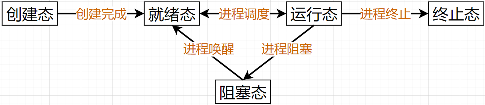
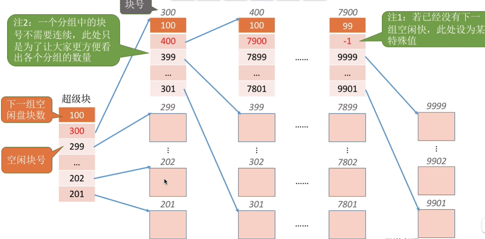

<h1 align="center">操作系统</h1>

## 操作系统特征与发展

        **概念**：

+ 控制和管理整个计算机系统的**软/硬件资源**。

+ 且合理**调度**计算机的工作和**资源分配**。

+ 以便给用户和其他软件方便的**接口**和**环境**。

+ 计算机系统中**最基本的系统软件**，**最接近硬件的层次**。

| 机器分类 | 内容              |
|:----:|:---------------:|
| 裸机   | 没有任何软件支持的计算机    |
| 虚拟机  | 覆盖了软件的机器，又叫扩充机器 |

| 接口分类      | 内容                            |
|:---------:|:-----------------------------:|
| 命令接口      | 联机命令接口（交互式cmd）、脱机命令接口（批处理bat） |
| 程序接口      | 给操作系统调用                       |
| GUI图像用户界面 | \                             |

| 特征  | 说明                                    |
|:---:|:-------------------------------------:|
| 并发  | 多个进程宏观感受上同时进行，微观实际上交替进行               |
| 共享  | 计算机同一资源可以给不同进程使用。分互斥和同步共享             |
| 虚拟  | 宏观感受和微观实际不一致，，分时分和空分复用技术              |
| 异步  | 并发执行的程序，因为访问临界资源或有执行顺序要求，走走停停、不可预知的推进 |

+ 并行：宏观和微观都是同时进行

+ 互斥共享：一段时间内不支持同时使用的资源。

+ 同时共享：一段时间内支持并发使用的资源。

+ 空分复用技术：进程文件宏观感受上都放入内存都能使用，微观实际上需要用时再调换内存。

+ 时分复用技术：多个进程宏观感受上同时进行，微观实际上交替进行。

+ 并发是通过共享和虚拟实现的，同时会遇到异步的问题。

| 发展历程      | 说明        | 问题       |
|:---------:|:---------:|:--------:|
| 手工操作阶段    | 手工装入纸带    | CPU空闲等人  |
| 单道批处理系统   | 脱机技术      | CPU空闲等设备 |
| 多道批处理系统   | 操作系统出现能调度 | 无人机交互    |
| 分时操作系统    | 时间片轮转     | 无法优先处理紧急 |
| 硬实时操作系统   | 规定时间内完成   | \        |
| 软实时操作系统   | 接收偶尔超时    | \        |
| 网络操作系统    | \         | \        |
| 分布式操作系统   | \         | \        |
| 个人计算机操作系统 | \         | \        |

---

## 操作系统体系结构

| 处理器状态 | 核心态  | 用户态   |
|:-----:|:----:|:-----:|
| 行使指令  | 特权指令 | 非特权指令 |
| 行使程序  | 内核程序 | 应用程序  |
| 行使功能  | 内核功能 | 非内核功能 |

+ 内核功能（资源相关、会影响其他进程的操作）：时钟管理，中断处理，原语，进程控制和通信、存储器管理、设备管理、IO指令、内存管理等

| 分类  | 代码量 | 执行功能 | 性能  | 维护  |
|:---:|:---:|:----:|:---:|:---:|
| 大内核 | 大   | 多    | 高   | 难   |
| 微内核 | 小   | 少    | 低   | 易   |

+ 类似于大内核小公司员工，微内核大公司员工。

---

### 中断

        **概念**：用户态向核心态转换的**唯一途径**，本质是请求操作系统介入。

| 分类  | 来源     | 细分           | 内容      |
|:---:|:------:|:------------:|:-------:|
| 内中断 | CPU内主动 | 陷入指令trap     | 如系统调用   |
| 内中断 | CPU内被动 | 软件终止         | 如缺页、除0  |
| 内中断 | CPU内被动 | 硬件故障         | 如电压不稳   |
| 外中断 | CPU外   | 可屏蔽外中断(INTR) | 使用中断屏蔽字 |
| 外中断 | CPU外   | 不可屏蔽外中断(NMI) | \       |

        **中断屏蔽字**：自己置1，对其他优先级低的置1，优先级高的置0。

        **中断隐指令**：中断发生时的隐含指令，自动产生和执行，过程：

                                $关中断→保存断点→引入中断服务程序$

|        | 中断期间工作内容                              |
|:------:|:-------------------------------------:|
| 操作系统   | 保存PC、保存中断屏蔽字、保存程序状态字、提供中断服务、初始化中断向量表、 |
| 中断服务程序 | 保存PC、通用寄存器保护                          |

        **系统调用**：应用程序需要操作系统服务，使用其提供的接口，主动型内中断。过程：$传入系统调用参数→执行陷入指令trap→执行相应服务程序→返回用户态$

---

## 进程管理

### 进程概念

        **进程实体**：由内存上的**程序段**、**数据段**、**进程控制块PCB**组成

        **进程动态**：一个程序**运行过程**和**相关活动**

| PCB组成   | 内容              |
|:-------:|:---------------:|
| 进程信息描述  | 进程身份PID、使用用户UID |
| 进程控制和管理 | 当前状态、优先级        |
| 资源分配清单  | 程序/数据段指针、键盘、鼠标  |
| 处理机相关信息 | 各寄存器值           |

        **多个进程组织方式**：链接方式、索引方式

        **进程特征**：动态性、并发性、独立性、异步性、结构性

---

### 进程状态

| 进程状态 | 说明           |
|:----:|:------------:|
| 创建态  | 初始化PCB、资源    |
| 就绪态  | 万事俱备，只差CPU   |
| 运行态  | 在CPU运行中      |
| 阻塞态  | 等待除CPU外的其他资源 |
| 终止态  | 回收资源，删除进程    |

        **状态切换**

        状态切换通过不可中断的原语控制：

|      | 原语                                       | 事件                  |
|:----:|:----------------------------------------:|:-------------------:|
| 创建完成 | 申请空白PCB→分配所需资源→初始化PCB→更改PCB状态插入就绪队列      | 用户登录、作业调度、提供服务、应用请求 |
| 进程终止 | 找到终止的PCB→若运行剥夺CPU→终止子进程→归还资源→删除PCB       | 正常结束、异常结束           |
| 进程阻塞 | 找到要阻塞的PCB→运行环境信息存入PCB→更改PCB状态插入阻塞队列      | \                   |
| 进程唤醒 | 找到要唤醒的PCB→将PCB从阻塞队列等待移除→更改PCB状态插入就绪队列    | \                   |
| 进程调度 | 运行环境信息存入PCB→插入就绪态队列→选择另一进程执行→根据PCB恢复运行环境 | \                   |

---

### 进程通信

        **概念**：为保护系统安全，不同进程之间的信息是不可以随意互相访问的，需要操作系统干预，通过操作系统提供的通信方式。

| 分类   | 内容                           |
|:----:|:----------------------------:|
| 共享存储 | 使用互斥共享空间                     |
| 管道通信 | 使用半双工管道，没写满不能读，没读完不能写        |
| 信息传递 | 使用信息缓冲队列的直接通信方式，或使用信箱的间接通信方式 |

---

### 线程

        **概念**：让进程拆分为线程，提高并发度。

        **属性**：

1. 线程是**CPU基本执行单元**，是**程序执行流最小单位**。

2. 线程有线程控制块TCB，也有就绪、阻塞、运行三种基本状态，是**调度的基本单位**。

3. **进程仍是资源分配的基本单位**，资源分配给进程，不分配给线程。

4. 同进程的线程切换**不需要换环境，系统开销小**。

5. 同进程的线程通信**不需要操作系统干预**。

6. 线程可分配到**CPU不同核心**上并行执行。

| 实现方式 | 用户级线程 | 内核级线程 | 切换速度 | 并发度 | 运行速度 | 操作系统 |
|:----:|:-----:|:-----:|:----:|:---:|:----:|:----:|
| 多对一  | 多     | 一     | 快    | 低   | 慢    | 不可见  |
| 一对一  | 一     | 一     | 慢    | 高   | 快    | 可见   |
| 多对多  | 多     | 多     | 折中   | 折中  | 折中   | 折中   |

---

### 调度

| 分类       | 内容       | 说明          |
|:--------:|:--------:|:-----------:|
| **高级调度** | **作业调度** | 指进程无→有的过程   |
| 中级调度     | 内存调度     | 指外存→内存的过程   |
| **低级调度** | **进程调度** | 指就绪态→运行态的过程 |

| 时机      | 内容                         |
|:-------:|:--------------------------:|
| 进程调度时机  | 主动放弃处理机、被动放弃处理             |
| 不能调度的时机 | 中断处理关中断、**操作系统内核程序临界区**、原语 |

+ 临界资源：一个时间段内只允许一个进程访问的互斥资源

+ 临界区：访问临界资源的代码

+ 进程调度方式：剥夺式、非剥夺式

| 性能指标         | 内容                     |
|:------------:|:----------------------:|
| CPU利用率       | $忙碌时间÷总时间$             |
| 系统吞吐量        | $总作业量÷总耗时$             |
| 作业周转时间       | $作业完成时间-作业提交时间$        |
| **作业带权周转时间** | $作业周转时间 ÷ 作业实际CPU执行时间$ |
| **等待时间**     | $周转时间-CPU执行时间-I/O操作时间$ |
| 响应时间         | $用户提交请求到收到响应的时间$       |

| 调度算法       | 系统  | 饥饿  | 选择/说明                       | 评价     |
|:----------:|:---:|:---:|:---------------------------:|:------:|
| 先来先服务FCFS  | 批处理 | 不会  | 先来的                         | 有利于长作业 |
| 短作业优先服务SJF | 批处理 | 会   | 短作业                         | 有利于短作业 |
| 高响应比优先HRRN | 批处理 | 不会  | 实时带权周转最小                    | 响应高    |
| 时间片轮转      | 交互  | 不会  | 1条时间片队列，时间片不能过大过小           | \      |
| 优先级调度算法    | 交互  | 会   | 优先级数高的，优先级数可以是变动的           | \      |
| 多级反馈队列算法   | 交互  | 会   | 多条时间片队列，队列优先级从高到低，时间片大小从小到大 | \      |

+ 优先级设计：系统进程>用户进程，前台>后台，I/O繁忙型进程>计算型进程

---

### 进程互斥

        **概念**：多个并发执行的进程，对互斥资源的访问不能同时进行。

| 代码段 | 说明         |
|:---:|:----------:|
| 进入区 | 对互斥资源的上锁阶段 |
| 临界区 | 对互斥资源的访问阶段 |
| 退出区 | 对互斥资源的解锁阶段 |
| 剩余区 | 其余代码       |

| 临界区进入原则 | 说明                |
|:-------:|:-----------------:|
| 空闲让进    | 没人使用可以进           |
| 忙则等待    | 有人使用要等待           |
| 有限等待    | 不能无限等下去           |
| 让权等待    | 等待时不占用CPU，让出来的人唤醒 |

| 实现方式             | 实现   | 内容                                | 违背原则           |
|:----------------:|:----:|:---------------------------------:|:--------------:|
| 单标志检查法           | 软件   | 进入只循环检查被转交，退出转交                   | 空闲让进、让权等待      |
| 双标志检查法           | 软件   | 先循环检查，后声明                         | 忙则等待、让权等待      |
| 双标志后检查法          | 软件   | 先声明，后循环检查                         | 空闲让进、有限等待、让权等待 |
| peterson算法       | 软件   | 先声明、选择让、后循环检查                     | 让权等待           |
| 中断屏蔽法            | 硬件   | \                                 | 不适合多核CPU       |
| TestAndSet、TSL指令 | 硬件   | 封装（先循环检查、后声明）                     | 让权等待           |
| Swap指令           | 硬件   | 封装（自己的false去循环交换资源的true）          | 让权等待           |
| 整型信号量法           | 软件原语 | 封装P（先声明信号--，后循环检查）,封装V（信号++）      | 让权等待           |
| 记录型信号量法          | 软件原语 | 封装P（先声明信号--，后检查阻塞）,封装V（信号++，唤醒阻塞） | \              |

注：PV操作中，P()又叫wait()，V()又叫sign()。

---

### 进程同步

        **概念**：多个并发执行的进程，按执行顺序要求的有序推进。

        **实现**：也是使用PV操作。

|      | PV区别              | 概念区别         |
|:----:|:-----------------:|:------------:|
| 进程同步 | 成对的P()，V()是在不同进程中 | 按先后顺序执行      |
| 进程互斥 | 成对的P()，V()是在同一进程中 | 不能同时进入同一个临界区 |

| PV例题集       | 互斥                                                                       | 同步                                                  |
|:-----------:|:------------------------------------------------------------------------:|:---------------------------------------------------:|
| 生产者消费者一对一问题 | 储物空间                                                                     | 消费者P(物)V(空)、生产者P(空)V(物)                             |
| 生产者消费者多对多问题 | 储物空间                                                                     | 消费者P(物1)V(空)、消费者P(物2)V(空)、生产者P(空)V(物1)、生产者P(空)V(物2) |
| 生产者消费者一对多问题 | 储物空间                                                                     | 消费者P(物1)V(空)、消费者P(物2)V(空)、生产者P(空)V(物1/物2)           |
| 写者读者问题      | ①读写空间【读者计数，第一个P()、最后一个V()】，②计数变量，③(产生写饥饿)，写优先，进入区互斥检查，读者进入后马上V，而读者要退出后才V | /                                                   |
| 哲学家进餐问题     | ①筷子空间，②最多支持n-1人同时进入筷子申请                                                  | /                                                   |

+ 格式：while(TRUE){代码段}

---

### 管程

        **属性**：

+ 任何时候只有一个进程在管程中执行。

+ 管程变量只能管程访问

+ 可实现进行的同步和互斥

---

### 死锁

        **概念**：各个进程互相等待对方手里的资源，导致各进程都阻塞，无法向前推进的现象。

| 必要条件，缺一不可 |
|:---------:|
| 互斥条件      |
| 不可剥夺      |
| 请求保持      |
| 循环等待链     |

---

#### 事前预防死锁

| 方式      | 内容                              | 评价     |
|:-------:|:-------------------------------:|:------:|
| 破坏互斥条件  | spooling技术，都可申请，放缓存队列再调度实现非互斥共享 | 稳定性差   |
| 破坏不可剥夺  | 设互斥资源为可剥夺                       | 会饥饿    |
| 破坏请求保持  | 静态分配，有进程需要的全部资源再分配给它            | 会饥饿    |
| 破坏循环等待链 | 编号资源，只能申请规定编号的资源                | 资源利用率低 |

---

#### 事中避免死锁

        **银行家算法**：分配资源前，先模拟分配后是否有安全序列（是否处于安全状态）。

        **安全序列**：找出能回收所有资源的分配顺序。

        **特性**：

+ 安全序列可能不唯一

+ 死锁一定处于不安全状态，处于不安全状态不一定死锁（进程会撤销，提取归还资源）

| 可能用到的数组 | 说明            |
|:-------:|:-------------:|
| 进程总需求   | $总需求=已获得+还需要$ |
| 进程已获得   | /             |
| 进程还需要   | /             |
| 进程申请中   | $申请中<还需要$     |
| 剩余可用资源  | /             |

---

#### 事后解除死锁

        **死锁检测法**：采用图型数据结构，度表示申请和分配，结点表示资源和进程        

| 死锁解除方法 | 说明          |
|:------:|:-----------:|
| 资源剥夺法  | 会饥饿         |
| 撤销进程法  | 会饥饿，代价大     |
| 进程回退法  | 设置还原点，算法开销大 |

        解除对象选择：优先级低的、刚执行的、剩余时间长的、占用资源多的

---

## 内存管理

| 内存管理内容    | 说明                      |
|:---------:|:-----------------------:|
| 内存空间分配与回收 | 连续分配和非连续分配              |
| 内存空间扩充    | 解决传统内存一次性，驻留性导致内存空间不够用  |
| 地址转换      | 逻辑地址与物理地址的转换            |
| 存储保护      | 各进程在自己的内存空间允许，不能越界访问和修改 |

---

### 连续分配

| 连续分配方式 | 说明                       | 内部碎片 | 外部碎片 |
|:------:|:------------------------:|:----:|:----:|
| 单一连续分配 | 分系统区/用户区，只有1道用户程序占整个用户区  | 有    | 无    |
| 固定分区分配 | 将内存划分为适用于所有进程的固定分区大小     | 有    | 无    |
| 动态分区分配 | 按需求分配，用空闲分区表和空闲分区链管理空闲空间 | 无    | 有    |

+ 内部碎片：分配给某进程的内存空间，因超出需求而有部分闲置

+ 外部碎片：未分配空闲分区的内存空间，因太小难以利用而有部分闲置

| 动态分区分配算法 | 内容               | 评价                           |
|:--------:|:----------------:|:----------------------------:|
| 首次适应算法   | 每次从头以空闲地址递增的顺序查找 | 最好的                          |
| 最佳适应算法   | 以空闲容量递增的顺序查找     | 最容易产生碎片的，产生更小难用的外部碎片，排序算法开销大 |
| 最坏适应算法   | 以空闲容量递减的顺序查找     | 大分区被用完无区可用，排序算法开销大           |
| 邻近适应算法   | 继上次结束的地址递增顺序查找   | 更容易使用高地址大分区                  |

### 非连续分配

#### 基本分页

        **概念**：将内存全部划分为**固定的、很小的分块/分页**，就**像一本书的每一页**。同进程信息**非连续存储**在各页面中，**通过页表对应和管理**。

| 术语    | 更多叫法         | 说明                                 |
|:-----:|:------------:|:----------------------------------:|
| 内存块号  | 物理块号、页帧号、页框号 | 每个分页的开始内存地址                        |
| 页面大小  | 页长、页大小、页面长度  | 每个分页的固定内存大小                        |
| 页内偏移量 | /            | 一张页能存储很多地址，在这张页从0开始的偏移量代表在本页中的具体地址 |
| 页表    | /            | **页号**与**内存块号**的映射关系表，页号从0开始，页号隐含  |
| 页表项   | /            | 页表中的一个对应关系                         |
| 页表长度  | /            | 某进程的页号总数，作越界判断                     |
| 页表寄存器 | /            | 存页表始址，页表长度，用于找页表位置                 |
| 页表位置  | /            | 存在进程控制块PCB中                        |
| 快表    | /            | 是页表的内存中的高速缓存，同Cache缓存原理            |

---

##### 单级页表——地址转换

1. 逻辑地址拆分：**单级页号|页内偏移量**

2. 越界判断：使用页表寄存器的页表长度，$页号≤页表长度$

3. 查询页表：使用页表寄存器的页表始址，偏移
   
   $单级页号数×页表项大小÷存储字长$，找到对应的内存块号

4. 具体地址：**内存块号|页内偏移量**

---

##### 多级页表——地址转换

        **来源**：页表占用不止一个内存块，也要非连续存储，需要上级页表对应其位置，**规定每级页表只能存在一个内存块中，方便越界判断**。

1. 逻辑地址拆分：**一级页号|二级页号|页内偏移量**

2. 越界判断：$每级页号≤log_2(页面大小÷页表项大小)$

3. 查询一级页表：使用页表寄存器的一级页表始址，偏移
   
   $一级页号×页表项大小÷存储字长$，找到对应的二级页表始址

4. 查询二级页表：使用二级页表始址，偏移
   
   $二级页号×页表项大小÷存储字长$，找到对应的内存块号

5. 具体地址：**内存块号|页内偏移量**

---

#### 基本分段

        **概念**：将内存全部划分为**动态的、很小的分段**。同进程信息**非连续存储**在各分段中，**通过段表对应和管理**。

| 术语    | 更多叫法      | 说明                                      |
|:-----:|:---------:|:---------------------------------------:|
| 段基址   | 段始址       | 每个分段的开始内存地址                             |
| 段长    | 段面大小、段面大小 | 每个分段的动态内存大小                             |
| 段内偏移量 | /         | 一个分段能存储很多地址，在这这个段从0开始的偏移量代表在本段中的具体地址    |
| 段表    | /         | **段号**与**段基址**、**段长**的映射关系表，段号从0开始，段号隐含 |
| 段表项   | /         | 段表中的一个对应关系                              |
| 段表长度  | /         | 某进程的段号总数，作越界判断                          |
| 段表寄存器 | /         | 存段表始址，段表长度，用于找段表位置                      |
| 段表位置  | /         | 存在进程控制块PCB中                             |
| 共享段   | /         | 某物理段共享，共享的成员的逻辑地址不一定相同                  |

---

##### 段表——地址转换

1. 逻辑地址拆分：**段号|段内偏移量**

2. 越界判断：使用段表寄存器的段表长度，$段号≤段表长度$

3. 查询页表：使用段表寄存器的段表始址，偏移
   
   $段号×段表项大小÷存储字长$，找到对应的段基址

4. 具体地址：**段基址|段内偏移量**

---

##### 段页表——地址转换

        **来源**：先分页，再分段，**既能固定内存分块大小，又能在一个内存块存不下一张页表的时候，灵活存储在动态连续内存块的分段中，不用分很多级页。**

1. 逻辑地址拆分：**段号|页号|段内偏移量**

2. 越界判断：使用段表寄存器的段表长度，$段号≤段表长度$

3. 查询段表：使用段表寄存器的段表始址，偏移
   
   $段号×段表项大小÷存储字长$，找到对应的页表始址

4. 查询页表：使用页表始址，偏移
   
   $页号×页表项大小÷存储字长$，找到对应内存块号

5. 具体地址：**内存块号|段内偏移量**

---

### 虚拟内存

        **概念**：基于空分复用技术，空间和时间局部性原理，按需将外存中的作业信息调入内存中。在段/页表的基础上增加**有效位、脏位、算法位、外村地址**等信息进行调入调出管理。

        **最大容量**：`Math.min([CPU最大寻址数,内外存实际容量和])`

| 特点  | 说明                          |
|:---:|:---------------------------:|
| 多次性 | 无需在作业运行时一次性调入内存，只允许分为多次调入内存 |
| 对换性 | 作业的换入换出                     |
| 虚拟性 | 从逻辑上扩充了内存的容量，用户感受上是扩充的      |

        **实现虚拟内存需要的功能**：页面分配功能、请求雕页功能、页面置换功能。

---

#### 页面分配功能

        **概念**：因不用全部调入，而给各进程提供可用的内存块的大小可变、可设大设小。

        **驻留集**：指在请求分页存储管理中，给进程分配的内存块总数集合。分可变和固定。

        **初始驻留集**：按进程大小或程序员预申请进行分配~~~~~~~~

| 驻留集调整方式  | 内容                         |
|:--------:|:--------------------------:|
| 固定分配局部置换 | 驻留集固定，只能在自己的驻留集换           |
| 可变分配全局置换 | 主动将空闲未分配的全局内存块纳入增加驻留集，以置换  |
| 可变分配局部置换 | 只能在自己的驻留集换，由操作系统对驻留集进行动态调整 |

|        | 操作系统调整驻留集的参靠指标                 |
|:------:|:------------------------------:|
| 工作集    | 某段时间内（窗口），进程实际访问的页面集合个数（集合要去重） |
| 颠簸（抖动） | 刚调出的又调入，刚调入的又调出。               |
| 缺页率    | 访存时的缺页占比                       |

---

#### 请求调页功能

        **概念**：访问信息不存在（有效位为0）时，发出缺页内中断，由操作系统负责将所需信息从外存调入内存。

        **注意**：

+ **一条指令**执行过程中可能因频繁调用不同地址的数据而产生**多次中断**。

+ 一般采用快慢表机制，同时访问TLB和慢表都没有，则缺页；缺页中断处理后，**需重新执行1次同时访问TLB和慢表**

---

#### 页面置换功能

        **概念**：操作系统调入时发现内存空间不够，需要换出部分页面。

| 置换算法         | 内容                                                                |
|:------------:|:-----------------------------------------------------------------:|
| 最佳置换OPT      | 无法实现，选择以后永不被使用，或在最长时间不被使用的置换                                      |
| 先进先出FIFO     | 先进先出，Belady异常，驻留集增大时，缺页率不减反增                                      |
| 最近最少使用LRU    | 局部统计法，统计最近一段时间的访问次数，替换最少访问的出去，算法位要求大，同时需要排序。                      |
| 时钟置换CLOCK    | 1算法位，刚放入和访问置1，替换时从上次地方继续，找完一轮从头再开始（像时钟一样），①找0的并且**置1为0**。**最多2轮** |
| 改进型时钟置换CLOCK | 改进要考虑脏位，①找0的未修改的，②找0的修改的并且**置1为0**，③找0的未修改的，④找0的修改的。**最多4轮**      |

---

## 文件管理

| 文件属性    | 说明                      |
|:-------:|:-----------------------:|
| 可见文件属性  | 文件名、文件类型、位置、大小、创建者、权限信息 |
| 不可见文件属性 | 标识符、地址                  |

| 文件结构     | 说明        |
|:--------:|:---------:|
| 顺序文件     | 顺序记录、链式记录 |
| 索引文件     | 1个索引对1个记录 |
| 索引顺序文件   | 1个索引对1串记录 |
| 多级索引顺序文件 | 多张索引      |

| 文件目录结构 | 说明                   |
|:------:|:--------------------:|
| 树目录结构  | 单级目录结构、两级目录结构、多级目录结构 |
| 有向无环图  | 多个目录共享指向一个文件         |

---

### 文件分配方式

        外存空间中，同内存一样采取分页分块的方式划分空间。一个分块叫物理块，磁盘块。

| 方式     | 逻辑块号         | 文件范围                                |
|:------:|:------------:|:-----------------------------------:|
| 连续分配   | 起始物理块\|长度    | $起始物理块→(起始物理块+长度)$                  |
| 隐式链接分配 | 起始物理块\|结束物理块 | $起始物理块→...→结束物理块$                   |
| 显式链接分配 | FAT文件物理块     | FAT文件记录了该文件的物理块链表                   |
| 索引分配   | 索引表物理块       | 索引表同页表，记录了逻辑块号与物理块号的映射关系，可有直接，多级、混合 |

+ 给出的文件逻辑地址中一般没有块内偏移量，不用计算块内偏移量。

---

### 存储空间管理

| 方式    | 说明     | 评价                |
|:-----:|:------:|:-----------------:|
| 空闲表法  | 用顺序表记录 | 空闲块离散得越多，占用空间越大   |
| 空闲链表法 | 用单链表记录 | 空闲块离散得越多，占用空间越大   |
| 位示图法  | 用矩阵记录  | 占用空间恒定            |
| 成组链接法 | 超级块    | 空闲越少占用越少，空闲越大占用越大 |

+ **超级块**：占用一个物理块，记录信息：**地址个数、地址**，首地址是下个超级块。末尾超级块首地址用特殊值置空，非首地址是一个个的空闲物理块。

---

### 文件功能

| 文件功能  | 说明                  |
|:-----:|:-------------------:|
| open  | 1项系统文件打开表、n项进程文件打开表 |
| close | 无系统打开文件表，才可关闭       |
| read  | 只有进行读文件才会将文件数据调入内存  |
| 共享    | 硬链接、软链接             |
| 保护    | 口令保护、加密保护、访问控制      |
| 其他功能  | write、creat、delete  |

+ **软链接**：访问文件路径，打开目标文件

+ **硬链接**：直接打开目标文件

+ **口令保护**：存储在本地，安全性差，速度快

+ **加密保护**：如异或运算，安全性高，速度慢

+ **访问控制**：权限管理，如LINUX的三大权限：读写可执行rwa

---

### 磁盘管理

#### 速度优化

        地址构成：**驻面号|盘面号|扇区号**

$总用时=启动(延迟)时间+寻道(移动)时间+寻区(旋转)时间+传输(旋转)时间$

| 磁头移动算法       | 内容                    | 评价        |
|:------------:|:---------------------:|:---------:|
| 先来先服务算法FCFS  | 先来先服务                 | 唯一不产生磁臂黏着 |
| 最短寻找时间优先SSTF | 最近磁道优先                | 会饥饿       |
| 扫描算法SCAN     | 移动到道边，换方向，来→回→来→回     | \         |
| LOOK调度算法     | 优化扫描，观察到道边是否还有，提起换向   | \         |
| 循环扫描算法CSCAN  | 移动到道边，从头再来，来→来        | \         |
| C-LOOK调度算法   | 优化扫描，观察到道边是否还有，提起从头再来 | \         |

| 减少延迟方法          | 说明               |
|:---------------:|:----------------:|
| 交替编号            | 逻辑相邻的扇区在物理上间隔、原因 |
| 驻面号\|磁盘号\|扇区号编号 | 顺序读取时，减少磁头移动次数   |
| 错位命名            | 同张盘面的逻辑编号也要错开、原因 |

+ **原因**：在读取完一个扇区后，准备读下一个扇区的时候，如果处于相邻的下一个扇区位置，或另一盘面的相邻的下一个扇区位置，可能因上一个扇区的寄存器数据还来不及取走，暂时不能读，当寄存器取走后可读时，已经转过了起始位置，要再旋转一圈后才能再读。

---

#### 磁盘格式化

| 格式化             | 内容                   |
|:---------------:|:--------------------:|
| 物理格式化/低级格式化     | 出厂前进行扇区划分，校验位、CDE盘划分 |
| 逻辑格式化/格式化/高级格式化 | CDE盘重划分、创建文件系统       |

---

#### 更多磁盘术语

| 更多磁盘术语 | 说明                      |
|:------:|:-----------------------:|
| 引导块    | 指向读取的入口位置               |
| RAID   | 磁盘阵列                    |
| 磁盘镜像   | 指复制到相同功能的存储装置           |
| 条带化    | 当多进程并行访问一个磁盘时，可能出现磁盘冲突。 |
| rpm    | 每分钟多少转                  |

---

## IO设备管理

### IO分类

| 依据   | 类别           |
|:----:|:------------:|
| 速度   | 低速、中速、高速     |
| 信息单位 | 块、字符         |
| 功能   | 人机交互、存储、网络通信 |

---

### IO控制方式

| IO控制方式 | 内容                                                |
|:------:|:-------------------------------------------------:|
| 程序查询方式 | CPU主动反复查询确认是否传输完成，无效查询多，但1s内CPU时钟周期数分配给查询的次数也是有限的 |
| 程序中断方式 | 在I/O准备好/传输完1次时，由I/O申请外中断，CPU被动                    |
| DMA控制器 | **块设备**，剥离CPU担任**传输中介**，直接与内外存进行数据块传输，结束申请中断      |
| 通道控制方式 | **硬件**(弱版CPU)，可处理CPU交付的内存中**I/O指令**，结束申请中断        |

---

### IO层次结构

| IO层次结构  | 内容                                      |
|:-------:|:---------------------------------------:|
| 用户层软件   | API                                     |
| 系统调用处理层 | I/O调度、设备保护、差错处理、设备分配回收，数据缓冲区管理、逻辑到物理LUT |
| 设备驱动层   | 因各设备内部电路不一样(控制信号不一样)，需要驱动，会以独立进程方式存在    |
| 中断处理层   | 中断处理                                    |
| 硬件层     | \                                       |

+ **I/O请求**：上到下，**I/O应答**：下到上

---

### IO管理表

| IO管理表      | 说明                                            |
|:----------:|:---------------------------------------------:|
| 设备控制表DCT   | 设备类型、设备标识符、设备状态、指向控制器表的指针、重复执行次数或时间、设备队列的队首指针 |
| 控制器控制表COCT | 控制器标识符、控制器状态、通信通道表的指针、控制器队列的队首/尾指针            |
| 通道控制表CHCT  | 通道标识符、通道状态、与通道连接的控制器表首址、通道队列的队首/尾指针           |
| 系统设备表SDT   | 记录全部设备的情况，设备类型、设备标识符、DCT、驱动程序入口               |

+ **系统找设备的方式**：找SDT→找DCT→找COCT→找CHCT

---

### IO缓冲

| IO缓冲方式 | 说明                                   |
|:------:|:------------------------------------:|
| 单缓冲    | 1个缓冲区，因读写互斥，通道原理，不能流水线               |
| 双缓冲    | 2个缓冲区                                |
| 循环缓冲区  | 将大小相等的缓冲区链接成一个循环队列                   |
| 缓冲池    | 处理空缓冲队列、输入队列、输出队列，有收容输入/输出，提取输入/输出模块 |

---

## 总结归纳

### 各种分配

| 各种分配       | 待分配资源 | 使用算法                     |
|:----------:|:-----:|:------------------------:|
| 进程调度/处理机分配 | 1个    | FCFS、SJF、时间片、优先级         |
| 内存分配       | 1个/多个 | 连续分配（对象少/临时）、非连续分配（段/页表） |
| 磁盘分配       | 多个    | 连续分配（对象多/持久）、非连续分配（索引表）  |
| 设备分配       | 1个    | FCFS、SJF、时间片、优先级         |

---

### 各种缓存

| 各种缓存  | 谁的缓存               |
|:-----:|:------------------:|
| Cache | CPU——Cache——内存快表   |
| 内存快表  | Cache——内存快表——内存慢表  |
| IO缓存  | 内存慢表——IO缓存——IO存储空间 |
