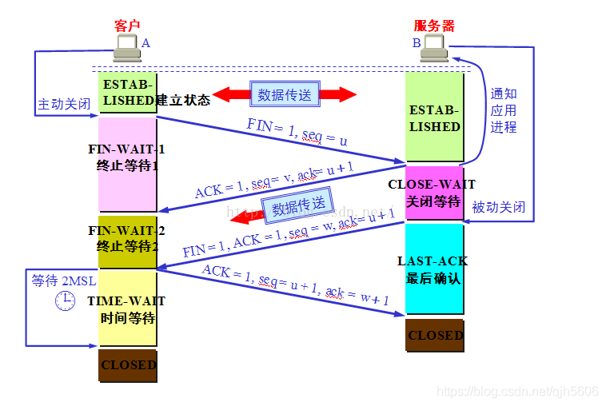
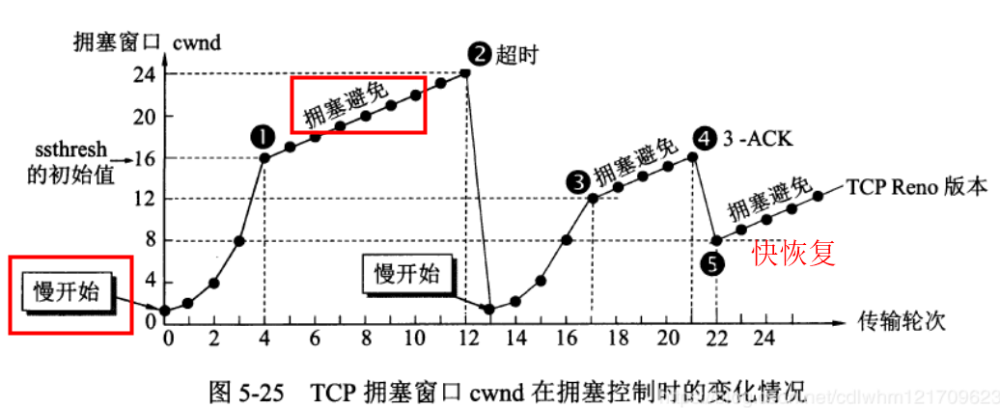

<h1 align="center">计算机网络</h1>

最近更新时间：2023-08-07

## 计算机网络概念

        **计算机网络概念**：分散的具有独立功能的计算机系统，通过**通信设备**与**线路**连接起来，由功能完善的软件实现**资源共享**和**信息传递**的系统，是**互连互通的**、**自治的**计算机集合。

| 功能    | 说明                |
|:-----:|:-----------------:|
| 数据通信  | 数据传输              |
| 资源共享  | 硬件使用权共享、软件共享、数据共享 |
| 分布式处理 | 通过分工提高效率          |
| 提高可靠性 | 使用替代机、备份机         |
| 负载均衡  | \                 |

| 依据   | 组成                          |
|:----:|:---------------------------:|
| 部分   | 硬件（线路、通信设备）、软件、协议           |
| 工作方式 | 边缘部分（P2P/CS）、核心部分（路由器）      |
| 功能   | 通信子网（网络层到物理层）、资源子网（应用层到会话层） |

| 依据   | 分类                            |
|:----:|:-----------------------------:|
| 分布范围 | 广域网WAN、域域网MAN、局域网WAN、个人区域网PAN |
| 使用者  | 公用网、专用网                       |
| 交换技术 | 电路交换、报文交换、分组交换                |
| 拓扑结构 | 总线型、星型、环型、网状型                 |
| 传输技术 | 广播式、点对点                       |

---

## 分层模型

        **来源**：网络实现需要大量功能支撑，因此需要划分层次，划分职责

        **法定标准**

| OSI分层参考模型 | 内容                         |
|:---------:|:--------------------------:|
| 应用层       | 用户与网络的界面                   |
| 表示层       | **数据格式**变换、数据加密解密、数据压缩与恢复  |
| 会话层       | 建立、同步、终止**会话**，校验点/同步点     |
| 传输层       | 可靠传输、差错控制、流量控制、复用分用        |
| 网络层       | 路由选择、差错控制、流量控制、拥塞控制        |
| 数据链路层     | 成帧、差错控制、流量控制、访问控制          |
| 物理层       | 定义接口特性、传输模式、传输速率、比特同步、比特编码 |

        **事实标准**

| TCP/IP分层参考模型 | 内容              | 协议                                                                   | 设备      | 传输两方          | 单元分割 |
|:------------:|:---------------:|:--------------------------------------------------------------------:|:-------:|:-------------:|:----:|
| 应用层          | 支持各种网络应用        | DHCP、RIP、BGP、FTP、SMTP、POP3、IMAP、DNS、HTTP、                            | \       | 应用→应用         | 报文   |
| 传输层          | 进程间的数据传输        | UDP、TCP                                                              | \       | 端口→端口，使用端口号   | 报文段  |
| 网络层          | 主机间数据分组和路由转发    | ARP、IPV4、IPV6、ICMP、OSPF                                              | 路由器     | 主机→主机，使用IP地址  | 数据报  |
| 数据链路层        | 把网络层传下来的数据报组装成帧 | GBN、SR、WDMA、FDMA、TDMA、CDMA、ALOHA、CSMA-CD/CA、Ethernet、802.11、PPP、HDLC | 交换机、网桥  | 设备→设备，使用MAC地址 | 帧    |
| 物理层          | 比特传输            | RJ45                                                                 | 中继器、集线器 | /             | 比特   |

| 协议三要素  | 说明             |
|:------:|:--------------:|
| 语义     | 规定了协议执行**功能**  |
| 语法     | 规定了传输数据的**格式** |
| 时序(同步) | 规定了传输数据的**次序** |

---

## 通信基础

| 术语    | 内容                                  |
|:-----:|:-----------------------------------:|
| 数据    | 传送信息的实体                             |
| 信号    | 数据的电气/电磁的表现，是数据在传输过程中的存在形式          |
| 数字信号  | 代表消息的参数取值是**离散**的                   |
| 模拟信号  | 代表消息的参数取值是**连续**的                   |
| 编码    | 生成可发送的数字信号                          |
| 调制    | 生成可发送的模拟信号                          |
| 基带信号  | 来自信源的信号，**直接**放在信道上传输               |
| 宽带信号  | 基带信号经过**调制**后，放在**模拟信道**上传输         |
| 信源    | 产生和发送数据的源头                          |
| 信宿    | 接受数据的终点                             |
| 信道    | 信号的传输媒介                             |
| 数字信道  | 传输数字信号的信道，**处理快**，**传输距离短、数据少、速率慢** |
| 模拟信道  | 传输模拟信号的信道，**处理慢**，**传输距离远、数据多、速率快** |
| 单工通信  | 单向通信，只有一个方向的通信而没有反方向的交互             |
| 半双工通信 | 双向通信，同一时刻只能有一方发送另一方接受数据             |
| 全双工通信 | 双向通信，两方可同时发送和接收数据，需两条信道             |
| 码元    | 固定时长的信号波形（不一定是平的），固定时长为码元宽度         |
| K进制码元 | 一个码元可以有K种不同信号表示方式                   |

| 性能指标              | 内容                      |
|:-----------------:|:-----------------------:|
| 带宽                | 某网络设备所支持的最高传输速率，单位bit/s |
| 比特率               | 信息传输速率，单位bit/s          |
| 波特率、码元传输速率        | 码元传输速率，单位baud           |
| 发送时延、传输时延         | $数据长度÷信道带宽$             |
| 传播时延              | $信道长度÷传播速率$             |
| 排队时延              | 进出路由器、末端设备的时间           |
| 处理时延              | 路由器、末端设备的处理时间           |
| 时延带宽积             | $传播时延×信道带宽$             |
| 往返时延RTT、ping、发送周期 | $传播时延×2＋末端处理时间$         |
| 信道利用率             | $有数据通过时间÷发送周期$          |
| 网络利用率             | 信道利用率的加权平均              |

---

## 物理层

### 接口特性

| 接口特性 | 内容                  |
|:----:|:-------------------:|
| 机械特性 | 规格、接口形状、引线数目、引脚数量   |
| 电气特性 | 电压范围、阻抗匹配、传输速率和距离限制 |
| 功能特性 | 某一电平表示何种意义          |
| 规程特性 | 各物理线路的工作规程和时序关系     |

---

### 传输速率

#### 奈氏准则

        **码间串扰**：因频率太高、码元传输速率太快导致的码元界线不清楚。

        在无噪音带宽受限下，为避免码间串扰：

                **信道极限波特率（Baud）**：$2W$

                **信道极限比特率（b/s）**：$2W×log_2n$，

                $W$：信道带宽Hz，$n$：码元进制数

---

#### 香农定律

        **失真**：码元波形在传输过程中受到干扰失去原来的形状，分可识别失真和无法识别失真。影响失真的因素有传输距离、噪声干扰、传输媒介质量。

        在带宽受限且有噪音的信道中，为避免无法识别的失真：

                **信道极限比特率（b/s）**：$W×log_2（1+S/N）$

                $W$：信道带宽Hz，信噪比$S/N=10^{dB÷10}$

---

### 信号发送

| 类型     | 信源信号类型 | 发送信号类型 |
|:------:|:------:|:------:|
| 数字发送器  | 数字信号   | 数字信号   |
| 调制器    | 数字信号   | 模拟信号   |
| PCM编码器 | 模拟信号   | 数字信号   |
| 放大调制器  | 模拟信号   | 模拟信号   |

---

#### 数字发送器

| 编码方式            | 代表1            | 代表0           | 评价                      |
|:---------------:|:--------------:|:-------------:|:-----------------------:|
| 非归零编码NRZ        | 高              | 低             | 需发送时钟周期信号，以区别2个相邻一样的码元  |
| 归零编码RZ          | 高低             | 低             | 需发送时钟周期信号，以区别2个相邻一样的码元  |
| **反向不归零编码NRZI** | 码元间不换电平        | 码元间换电平        | 需发送时钟周期信号，以区别2个相邻一样的码元  |
| 曼彻斯特编码          | 高低/低高          | 低高/高低         | 无需时钟信号                  |
| **差分曼彻斯特编码**    | 码元间不换电平，码元中换电平 | 码元间换电平，码元中换电平 | 比反向不归零多了码元中间必换电平，无需时钟信号 |
| 4b/5b编码         | \              | \             | 用5b编码表示4b数据，1b来控制       |

---

#### 调制器

| 调制方式 | 说明                  |
|:----:|:-------------------:|
| 调幅   | 振幅不同高低              |
| 调频   | 频率不同高低              |
| 调相   | 正余弦等                |
| QAM  | 排列组合调幅调相，总数：调幅数×调相数 |

+ QAM不用调频可能是因为频率是用来增加传输的抗干扰性。

---

#### PCM编码器

        **步骤**：

1. 抽样：$采样频率≥2模拟信号最高频率$，因为模拟信号1Hz可以看成是正余弦函数$y＝Acos(πx＋B)$，只需2组$(x，y)$，即可求出A、B得到1Hz的整个函数。

2. 量化：对振幅进行分级标度，使用二进制位数表示，标度越多，位数越长，精度越高

3. 编码：一个采样点记录其所处位置最近的一个分级标度二进制数。

        **44100Hz**：人耳听力频率范围20Hz-20KHz，得采样频率≥40KHz

---

#### 放大调制器

        提高模拟信号的频率，来提高传播过程的抗干扰性。

---

### 传输介质

| 传输介质     | 类别                | 信号形式 | 组成                       | 例子            |
|:--------:|:-----------------:|:----:|:------------------------:|:-------------:|
| 双绞线      | 导向性               | 电    | 多组两根采用一定规则并排绞合的，相互绝缘的铜导线 | RJ45网线（4组8根）  |
| 同轴电缆     | 导向性               | 电    | 导体铜质芯线、绝缘层、网状编制屏蔽层、塑料外层  | 电视接口          |
| 光纤       | 导向性               | 光    | 纤芯实芯、包层                  | 单模光纤、多模光纤     |
| 无线电波     | 非导向性,所有方向传播，穿透能力强 | 光    | \                        | \             |
| 微波       | 非导向性,固定方向传播，频率较高  | 光    | \                        | 地面微波接力通信、卫星通信 |
| 红外线、激光射线 | 非导向性,固定方向传播，频率较高  | 光    | \                        | \             |

+ 双绞原因：右手螺旋定则

+ 单模光纤：直线传播，损耗少，距离远

+ 多模光纤：反射传播，损耗多，距离近

---

## 数据链路层

#### 功能概述

| 功能       | 说明                          |
|:--------:|:---------------------------:|
| 封装成帧     | 实现帧定界、帧同步                   |
| 差错控制     | 对帧错、位错检查与更正                 |
| 流量控制     | 控制发送方的发送速度                  |
| 介质访问控制   | 解决信息同时传输时的冲突                |
| 链路管理     | 面向连接服务连接的建立、维持、释放           |
| 为网络层提供服务 | 无确认无连接服务、有确认无连接服务、有确认面向连接服务 |

---

### 封装成帧

        **概念**：在数据部分首尾添加帧首部/帧尾部进行**帧定界**，从而实现接收方**帧同步**。

| 组帧方式   | 说明                             | 评价      |
|:------:|:------------------------------:|:-------:|
| 字符计数法  | 首添加记录，后面有几位                    | 一错满盘皆错  |
| 字符填充法  | 首尾添加ASCII控制字符、数据内容与之相同加转义字符    | 复杂、兼容性差 |
| 零比特填充法 | 首尾添加6个0，数据内容遇到5个0就插1，解码遇到5个0删1 | 常用      |
| 违规编码法  | 首尾使用无意义的电平                     | 常用      |

---

### 差错控制

| 差错类别 | 说明          |
|:----:|:-----------:|
| 位错   | 1变0，0变1     |
| 帧错   | 位丢失、位重复、位失序 |

+ 奇偶检验码、CRC循环冗余码、海明码控制差错见《计算机组成原理》

---

### 流量控制

| 流量控制方式    | 发送窗口 | 接收窗口 | 特性             | 评价       |
|:---------:|:----:|:----:|:--------------:|:--------:|
| 停止等待协议    | 1    | 1    | 超时重传，回复确认      | 信道利用率太低  |
| 后退N帧协议GBN | N    | 1    | 超时重传，回复确认，累计确认 | 无情丢弃后退重传 |
| 选择重传协议SR  | N    | N    | 超时重传，回复确认，累计确认 |          |

+ **超时重传**：发送方设超时计数器，时长设比RTT更长一点。

+ **回复确认**：接收方在收到任何帧，都会回复确认，都是期待下一个没收到的。

+ **累计确认**：发送方收到后面确认帧默认前面已成功。

+ **N取值限制**：$发送窗口+接收窗口≤帧编号总数$

---

### 介质访问控制

| 介质访问控制方式   | 类别    | 说明                                                            |
|:----------:|:-----:|:-------------------------------------------------------------:|
| 频分多路复用FDMA | 静态    | 使用不同**频率**                                                    |
| 时分多路复用TDMA | 静态    | **时间片**轮转                                                     |
| 波分多路复用WDMA | 静态    | 使用不同**光频**                                                    |
| 码分多路复用CDMA | 静态    | 数学法，**向量**加法、内积、单位化                                           |
| ALOHA协议    | 动态    | 想法就发，冲突重发                                                     |
| 时隙ALOHA协议  | 动态    | 在信道分段的开始才能发                                                   |
| 坚持CSMA协议   | 动态    | 忙**一直监听**，空闲**马上发**                                           |
| 非坚持CSMA协议  | 动态    | 忙**随机**时间再监听，空闲**马上发**                                        |
| p坚持CSMA协议  | 动态    | 忙**随机**时间再监听，空闲**p概率**发                                       |
| CSMA-CD协议  | 动态、总线 | **检测算法、重发时间、最小帧长**                                            |
| CSMA-CA协议  | 动态、无线 | 监听→空闲发出**请求连接RTS**→**响应请求CTS**→**预约信道**(告诉其他站点)→发完需**ACK确认帧** |
| 轮询协议       | 动态    | 主结点循环**轮流询问**每个结点是否需要发送数据，需要则**独占信道**发送，没有MA                  |
| 令牌传递协议     | 动态    | **令牌**(特殊格式的MAC控制帧)循环在每个结点流动，发数据要持有令牌                         |

+ CSMA-CD协议**检测算法**：当发送数据后经过$＜2倍的传播时延后$后接受到数据，说明发生冲突。

+ CSMA-CD协议**重发时间**：第k次重发，随机数取值范围$[0,2k-1]$，经过等待时间$随机数×2倍的传播时延$，后重发，**重发最大15**，**第16次报告网络拥挤**，但**k最大只能取到10**。

+ CSMA-CD协议**最短帧长**：在检测到冲突时帧没有发完，**以太网最短帧长64B**。

---

### 局域网协议 IEEE 802

| 内容     | 说明              |
|:------:|:---------------:|
| 802.3  | **Ethernet以太网** |
| 802.4  | 令牌总线网           |
| 802.5  | 令牌环网            |
| 802.6  | 域域网             |
| 802.7  | 宽带技术            |
| 802.8  | 光纤技术            |
| 802.11 | **无线局域网**       |

---

#### Ethernet以太网 802.3

        **概念**：**基带总线**局域网规范、使用**CSMA/CD**介质访问控制技术

        **特点**：造价低、速度快10Mb/s-10Gb/s

        **发展**：同轴电缆→双绞线＋集线器

                    总线型→星型（逻辑上仍是总线型）

| MAC帧格式 | 大小       |
|:------:|:--------:|
| 前导码    | \        |
| 目的地址   | 6B       |
| 源地址    | 6B       |
| 类型     | 2B       |
| 数据     | 46-1500B |
| FCS    | 4B       |

+ **最短帧长64B**

| 术语       | 说明                |
|:--------:|:-----------------:|
| 10BASE-T | 10Mb/s，T：双绞线，F：光纤 |
| 通信适配器    | 网卡，MAC地址          |
| 高速以太网    | ≥100Mb/s          |

---

#### 无线局域网 802.11

| MAC帧格式 | WDS无线分布式系统 | IBSS不跨基站 | To AP  | From AP |
|:------:|:----------:|:--------:|:------:|:-------:|
| 帧控制    | \          | \        | \      | \       |
| 生存周期   | \          | \        | \      | \       |
| 地址1    | 接收端RA      | 目的地址DA   | BSSID  | 目的地址DA  |
| 地址2    | 发送端TA      | 源地址SA    | 源地址SA  | BSSID   |
| 地址3    | 目的地址DA     | BSSID    | 目的地址DA | 源地址SA   |
| 序列控制   | \          | \        | \      | \       |
| 地址4    | 源地址SA      | \        | \      | \       |

+ 基站分固定、无固定

+ 看前两个接收方、发送方是谁就知道是哪种类型

---

### PPP协议

        **概念**：点对点协议

        **特点**：全双工、简单、封装成帧、透明传输、多种网络层协议、多种类型链路、差错检测、检测连接状态、最大传送单元、无需纠错、无需流量控制

| MAC帧格式 | 大小    |
|:------:|:-----:|
| F      | 1B    |
| A      | 1B    |
| C      | 1B    |
| 协议     | 1B    |
| 数据     | 1500B |
| FCS    | 2B    |
| F      | 1B    |

---

### HDLC协议

        **概念**：高级数据链路控制

| MAC帧格式 | 大小  |
|:------:|:---:|
| F      | 1B  |
| 地址     | 1B  |
| 控制     | 1B  |
| 信息帧    | 可变  |
| 数据     | 2B  |
| F      | 1B  |

---

### 设备

        交换机是多口网桥。

| 网桥分类  | 说明                           |
|:-----:|:----------------------------:|
| 透明网桥  | 转发表记录信息源MAC地址与接口映射关系         |
| 源路由网桥 | 广播发送发现帧，到目的地址上的设备依次回复，记录最佳路线 |

| 交换机分类    | 说明             |
|:--------:|:--------------:|
| 直通式      | 查完目的地址就发，不检测错误 |
| 存储转发式交互性 | 检测错误           |

+ **冲突域**：被链路层设备隔离的区域，域内无冲突控制，域外有冲突控制。

+ **广播域**：被网络层设备隔离的区域，广播范围为域内，一般不转发到域外。

---

## 网络层

        **功能概述**：最佳路径、异构网络互联、拥塞控制、提供主机与主机之间的逻辑通信 

---

### ARP协议

        **概念**：地址解析协议，通过IP地址找MAC地址，存IP地址与MAC地址的映射表。

        **注意**：在OSI分层参考模型属于数据链路层、在TCP/IP分层参考模型属于网络层

        **过程**：

1. 检查**ARP高速缓存**：是否有某IP对应的MAC地址，有则直接使用

2. 没有则用目的**MAC地址为全1**以广播ARP请求分组

3. 目的IP的主机收到请求后会向源主机单播一个**ARP响应分组**，源主机收到后写入ARP高速缓存。

---

### IPV4协议

#### IPV4数据报格式

| IPV4数据报格式 | 大小    | 类别   | 说明                              |
|:---------:|:-----:|:----:|:-------------------------------:|
| 版本        | 0.5B  | 首部固定 | 表示IP版本号，IPV4为0100，IPV6为0110     |
| 首部长度      | 0.5B  | 首部固定 | 表示固定首部长度，有多少个4B                 |
| 区分服务      | 1B    | 首部固定 | 使用才有意义，实际很少用到                   |
| 总长度       | 2B    | 首部固定 | 表示IP数据报总长度，有多少个1B               |
| 标识        | 2B    | 首部固定 | 数据报太长(达MTU)分片，某分片的标识符           |
| 标志        | 3b    | 首部固定 | 第1位无效、第2位DF是否禁用分片，第3位MF后面是否还有分片 |
| 片偏移       | 13b   | 首部固定 | 代表分片在原分组的偏移，有多少个8B              |
| 生存时间      | 1B    | 首部固定 | 生命值，经过路由器-1，变成0丢弃               |
| 协议字段      | 1B    | 首部固定 | 表示传输层协议                         |
| 首部检验和     | 2B    | 首部固定 | 首部的校验位，以2B为单位，求和取反              |
| 源地址       | 4B    | 首部固定 | 发送方IPV4地址                       |
| 目的地址      | 4B    | 首部固定 | 接收方IPV6地址                       |
| 可选字段      | 0-40B | 首部可变 | 排错、测量、安全                        |
| 填充        | /     | 首部可变 | 凑成首部4B整                         |
| 数据        | /     | 数据   | TCP\UDP等传输层报文段                  |

+ 各种长度记忆：1总8片的首4

+ 求和取反：取反方法是与全0异或运算

+ 差错和拥塞会丢失IP分组，可靠性传输至少需要序号和校验位

---

#### IPV4地址

        **组成**：**网络号|主机号**

        **大小**：32位二进制数，**点分十进制表示法**

| IPV4地址分类 | 类别为  | 第1位数范围  | 网络号段数 | 主机号段数 | 私有IP                        |
|:--------:|:----:|:-------:|:-----:|:-----:|:---------------------------:|
| A类       | 0    | 0-127   | 1     | 3     | 10.0.0.0-10.255.255.255     |
| B类       | 10   | 128-192 | 2     | 2     | 172.16.0.0-172.31.255.255   |
| C类       | 110  | 192-223 | 3     | 1     | 192.168.0.0-192.168.255.255 |
| D类       | 1110 | 224-239 | \     | \     | \                           |
| E类       | 1111 | 240-255 | \     | \     | \                           |

+ 开头类别位，哈夫曼编码

| 特殊IP            | 作用           | 源地址 | 目的地址 |
|:---------------:|:------------:|:---:|:----:|
| 0.0.0.0         | 表示自己的主机      | √   |      |
| 255.255.255.255 | 表示向本网广播      |     | √    |
| 主机号全0           | 表示自己网络号的整个网络 | √   |      |
| 主机号全1           | 向某网络号广播      |     | √    |
| 127.0.0.1       | 环回地址，表示自己    |     | √    |

#### IPV4术语

| 术语          | 说明                                            |
|:-----------:|:---------------------------------------------:|
| 网络地址转换NAT   | 局域网内私有IP与公网IP的转换，并记录在NAT表中，以能让局域网内的私有IP进行网络访问 |
| 子网划分        | 无分类编址的前身，$网络号\vert 主机号高位网络号\vert 主机号$         |
| 子网掩码        | 子网划分后，以表示网络号的位数                               |
| 默认网关        | 本网路由器地址，默认网关输入正确可以访问路由器外部网路                   |
| 无分类编址CIDR   | $网络前缀号\vert 主机号/网络前缀号数量$                      |
| 构成超网、路由聚合技术 | 如果多个子网下一跳都是个同路由器，求多个子网的最大公网络前缀号，作为下个路由器的超网    |

---

### IPV6协议

#### IPV6数据报格式

| IPV6数据报格式 | 大小   | 类别   | 说明                          |
|:---------:|:----:|:----:|:---------------------------:|
| 版本        | 0.5B | 首部   | 表示IP版本号，IPV4为0100，IPV6为0110 |
| 优先性       | 1B   | 首部   | 区分数据报的类型和优先级                |
| 流标签       | 2.5B | 首部   | 从特定源点到特定终点的一系列数据报，同流具相同标签   |
| 有效载荷长度    | 2B   | 首部   | 有效载荷长度有多少个8B                |
| 下一个首部     | 1B   | 首部   | 指向下一个扩展首部                   |
| 跳数限制      | 1B   | 首部   | 生命值，经过路由器-1，变成0丢弃           |
| 源地址       | 16B  | 首部   | 发送方IPV6地址                   |
| 目的地址      | 16B  | 首部   | 发送方IPV6地址                   |
| 扩展首部      | \    | 有效载荷 | 必须8B倍数                      |
| 数据        | \    | 数据   | TCP\UDP等传输层报文段              |

+ 与IPV4区别：IP数量加大、区分服务/分片/校验/协议字段/长度统计移除、即插即用(直接分配**无需DHCP**)、只能主机分片

---

#### IPV6地址

        **冒号十六进制表示法**：八段、每段4个十六进制

+ 前导压缩法：每段的最左侧连续0可省，但每段至少有1位

+ 双冒号法：中间连续全0的段可以省，用::表示省略段的区域，但只能用一次。

| IPV6地址分类 | 说明     |
|:--------:|:------:|
| 单播地址     | 一对一    |
| 多播地址     | 一对多    |
| 任播地址     | 选最近的一个 |

| IPV4和IPV6的过渡技术 | 说明                      |
|:--------------:|:-----------------------:|
| 双栈协议           | 和IPV4一起用                |
| 隧道技术           | 在不能传IPV6的设备前用IPV4重封装过隧道 |

+ IPV6内嵌IPV4表示法，::123.345.234.234，::FFFF:123.345.234.234

---

### ICMP协议

        **概念**：网际控制报文协议，用于网络层差错控制，测试连通性和经过路由器个数

| ICMP差错报文 | 内容         |
|:--------:|:----------:|
| 终点不可达    | 无法交付       |
| 源点控制     | 拥塞丢弃       |
| 时间超过     | 寿命为0，或超时   |
| 参数问题     | 首部字段有问题    |
| 改变路由     | 值得更快速的路由通路 |

+ 出现上述差错不发的情况有：错的对象为ICMP报文、除了第1个IP分片、组播地址、特殊IP地址。

| ICMP询问报文  | 内容                       |
|:---------:|:------------------------:|
| 回送请求和回答报文 | PING测试两个主机直接的连通性         |
| 时间请求和回答报文 | Traceroute测试从源点到终点的路由器个数 |

---

### OSPF协议

        **概念**：开放式最短路径优先，属于内部网关路由选择协议IGP

        **过程**：

1. 每个路由器发现它的邻居结点(hello问候文组，10s一次)，了解邻居节点网络地址

2. 设置到它的每个邻居的**成本度量metric**

3. 构造DD数据库描述分组，向邻站给出自己的链路状态数据库中的咋摘要信息（1）

4. 如果邻站没有我的信息会申请，向我发送LSR链路状态请求分组（2）

5. 收到邻站申请后，我会回送LSU链路状态更新分组（3）

6. 邻站收到更新后，会返回一个LSAck链路专题确认分组（4）

7. 使用**dijkstra算法**根据自己的链路状态数据库构造到其他节点间的最短路径

---

### 移动IP

| 术语        | 说明                           |
|:---------:|:----------------------------:|
| 移动结点      | 具有永久地址的移动设备                  |
| 归属代理、本地代理 | 移动结点的就居所中执行移动管理功能的实体，家长      |
| 外部代理、外地代理 | 在外部网络中帮助移动过节点完成移动管理功能的实体，其他家 |
| 永久地址      | 移动站点在归属网络中的原始地址              |
| 转交地址      | 移动站点在外部网络使用的临时地址             |

+ 申请转交地址后，传到本地代理的数据会用隧道技术重新封装发到外部代理，外部代理拆封后给申请者

---

## 传输层

        **功能概述**：提供进程间的逻辑通信、复用与分用、差错检测

        **复用**：应用层所有的应用进程端口号都可通过传输层到网络层（上到下的过程）

        **分用**：传输层从网络层收到数据后交代指明的应用进程端口号（下到上的过程）

---

### UDP协议

        **特点**：无连接、适用小文件、面向报文、无拥塞控制

| 报文段格式  | 大小  | 类别  | 说明                 |
|:------:|:---:|:---:|:------------------:|
| 源端口号   | 2B  | 首部  | 要回信需要填，否则填全0       |
| 目的端口号  | 2B  | 首部  | 实现传输层分用            |
| UDP长度  | 2B  | 首部  | 包括数据的整个长度，多少个1B，1总 |
| UDP检验和 | 2B  | 首部  | 伪首部校验位、求和取反        |
| 数据     | /   | 数据  | 应用层报文              |

| 伪首部格式 | 大小  | 说明         |
|:-----:|:---:|:----------:|
| 源IP   | 4B  | \          |
| 目的IP  | 4B  | \          |
| 补0    | 1B  | 凑2B整       |
| 协议    | 1B  | TCP6，UDP17 |
| UDP长度 | 2B  | 源于首部       |

+ UPD和TCP校验和对象都是这个伪首部

---

### TCP协议

        **特点**：面向连接、适用大文件、点对点、全双工通信

| 报文段格式      | 大小   | 类别   | 说明                                     |
|:----------:|:----:|:----:|:--------------------------------------:|
| 源端口号       | 2B   | 固定首部 | 要回信需要填，否则填全0                           |
| 目的端口号      | 2B   | 固定首部 | 实现传输层分用                                |
| seq序号      | 4B   | 固定首部 | 报文按字节分割后编号，第一个字节的序号，(发送方和接收方各自独立顺序的编号) |
| ack确认号、期待号 | 4B   | 固定首部 | 期待对方下一个分割报文段序号                         |
| 数据偏移       | 0.5B | 固定首部 | 首部长度，多少个4B，首4                          |
| 保留         | 6b   | 固定首部 | \                                      |
| 控制紧急位UGR   | 6b   | 固定首部 | 紧急任务需要插队                               |
| 控制确认位ACK   | 1b   | 固定首部 | 控制位的回复确认                               |
| 控制推送位PSH   | 1b   | 固定首部 | 告诉接收方这个报文段要提早上交                        |
| 控制复位位RST   | 1b   | 固定首部 | 发生大错重连                                 |
| 控制同步位SYN   | 1b   | 固定首部 | 用于建立连接                                 |
| 控制终止位FIN   | 1b   | 固定首部 | 用于终止连接                                 |
| rwnd窗口     | 2B   | 固定首部 | 流量控制，设置发送方只能发到seq序号                    |
| 检验和        | 2B   | 固定首部 | 伪首部校验位、求和取反                            |
| 紧急指针       | 2B   | 固定首部 | 紧急数据部分的偏移量                             |
| 首部可变       | \    | 可变首部 | \                                      |
| 填充         | \    | 可变首部 | 凑4B整                                   |
| 数据         | \    | 数据   | 应用层报文                                  |

---

#### TCP连接建立

        **三次握手过程**：

1. 客户端发送连接请求连接报文段，无应用层数据：
   
   $seq＝x(开头随机)$，$SYN＝1$

2. 服务器为该连接分配缓存和变量，返回确认报文段，允许连接，无应用层数据：
   
   $seq＝y(开头随机)$，$ack期待号＝x＋1$，$SYN＝1$，$ACK＝1$

3. 客户端为该连接分配缓存和变量，返回确认的确认，默认携带了应用层数据：
   
   $seq＝x＋1$，$ack期待号＝y＋1$，$SYN＝0$，$ACK＝1$

---

#### TCP连接终止

        **四次握手过程**：

1. 客户端主动关闭TCP连接：
   
   $seq＝u(x后某数)$，$ack期待号＝k(y后某数)$，$FIN＝1$

2. 服务端收到并回送待关闭确认报文段，服务器释放中（因为被动释放的要时间处理）:
   
    $seq＝k$，$ack期待号＝u＋1$，$ACK＝1$

3. 服务端释放完毕，回送已关闭确认报文段：
   
   $seq＝k+1$，$ack期待号＝u＋1$，$FIN＝1$，$ACK＝1$

4. 客户端收到并回送一个确认的确认，并等待2倍最长报文段寿命时间后彻底关闭：
   
   $seq＝u＋1$，$ACK＝1$
   
   

---

#### TCP拥塞控制

| 特性             | 说明                            |
|:--------------:|:-----------------------------:|
| 回复确认、累计确认、超时重传 | 同链路层窗口协议                      |
| 快速重传           | 收到**3个重复确认**，则认为该期待报文段丢失，马上重传 |
| 窗口查询           | 当发送方窗口设置计算为0时，定期主动询问是否有窗口     |

| 时机   | 采用算法 | 算法含义：调整的窗口值      |
|:----:|:----:|:----------------:|
| 刚开始  | 慢开始  | 1                |
| 超时重传 | 慢开始  | 1                |
| 快速重传 | 快恢复  | 重复时窗口数的一半，即慢开始门限 |

| 两个增长阶段 | 采用算法 | 算法含义：窗口的增长率 |
|:------:|:----:|:-----------:|
| ＜慢开始门限 | 网络试探 | ×2          |
| ≥慢开始门限 | 拥塞避免 | +1          |

+ 慢开始门限初始值16，后续动态调整。调整时机触发超时重传、快速重传。调整值为其窗口的一半。

---

## 应用层

| 服务模型      | 说明                                                      |
|:---------:|:-------------------------------------------------------:|
| 客户服务器模型CS | 服务器需永久提供服务、永久性访问地址/域名，客户端使用服务器服务是间歇性接入，动态IP，不与其他客户机直接通信 |
| P2P模型     | 不存在永远在线的服务器，每台主机既可以提供服务也可以使用服务                          |

| 协议汇总     | 协议      | 端口号     | 概念                     |
|:--------:|:-------:|:-------:|:----------------------:|
| DHCP协议   | UDP     | 68      | 动态主机配置协议，用于申请IPV4地址    |
| RIP协议    | UDP     | 520     | 路径信息协议，属于内部网关路由选择协议IGP |
| BGP协议    | TCP     | 179     | 边界网关协议，属于外部网关路由选择协议EGP |
| FTP协议    | TCP/UDP | 21      | 文件传输协议                 |
| Telnet协议 | TCP     | 23      | 远程终端协议                 |
| SMTP协议   | TCP     | 25      | 简单邮件传输协议，用于服务器接收电子邮件   |
| POP3协议   | TCP     | 110     | 邮局协议，用于用户接收电子邮件        |
| IMAP协议   | TCP     | 143、993 | 交互式邮件存取协议，用于户接收电子邮件    |
| DNS系统    | TCP/UDP | 53      | 域名解析协议，通过域名找IP地址       |
| HTTP协议   | TCP     | 80      | 超文本传输协议，用于web资源请求和响应   |

---

### DHCP协议

        **概念**：动态主机配置协议，用于申请IPV4地址

        **过程**：

1. **主机广播DHCP发现报文**："有没有DHCP服务器呀？"，0.0.0.0→255.255.255.255

2. **DHCP服务器广播DHCP提供报文**："有，并提供"，可能有多个回复

3. **主机广播DHCP请求报文**："我用某个DHCP服务器的IP地址"

4. **DHCP服务器广播DHCP确认报文**："用吧"，本DHCP服务器确认分配，其他DHCP服务器收回

---

### RIP协议

        **概念**：路径信息协议，属于内部网关路由选择协议IGP

        **过程**：相邻路由每30s用RIP报文交换1次距离向量，180s没交换则认为此邻居已关闭

| 距离向量算法       | 存入      |
|:------------:|:-------:|
| 若没有          | 直接存入    |
| 若有，下一跳是该邻居   | 选择保留最新的 |
| 若有，下一跳是其他邻居到 | 选择保留最近的 |

+ 向量距离最大15，向量距离16不可达。

+ 算法比OSPF简单。但好消息传的快，坏消息传得慢。
  
  ---

### BGP协议

        **概念**：边界网关协议，属于外部网关路由选择协议EGP

        **过程**：自治系统AS选择一个BGP发言人（一般是边界路由器），交换网络可达性的信息，变化更新

        **BGP报文分类**：OPEN报文，UPDATA报文，KEEPALIVE报文，NOTIFICATION报文

---

### FTP协议

        **概念**：文件传输协议

        **过程**：1个始终保持的主进程，n个进行数据传送的临时进程

---

### SMTP协议

        **概念**：简单邮件传输协议，用于服务器接收电子邮件

        **特点**：只支持7比特的ASCII码内容传输，  不支持可执行、不支持非英语文字、长度限制。

---

### POP3协议

        **概念**：邮局协议，用于用户接收电子邮件

        **特点**：用户下载服务器的邮件后，服务器会删除

---

### IMAP协议

        **概念**：交互式邮件存取协议，用于户接收电子邮件

        **特点**：用户下载服务器的邮件后，服务器不删除，可按需下载

---

### DNS系统

        **概念**：域名解析协议，通过域名找IP地址

        **域名**：不区分大小写，分根域名、一级域名、二级域名、三级域名

        **过程**：1.本地域名服务器

                    2.根域名服务器(1次)

                    3.顶级域名服务器(2次)

                    4.权限域名服务器(3次)

                    5.目标服务器(4次)

| 域名解析过程 | 说明     |
|:------:|:------:|
| 递归查询   | 别人找，少用 |
| 迭代查询   | 自己找，常用 |

+ 本地域名服务器高速缓存：将最近访问的域名与IP记录下来，命中则只用查询1次

---

### HTTP协议

        **概念**：超文本传输协议，用于web资源请求和响应

        **HTTP报文分类**：HTTP请求报文、HTTP响应报文

| HTTP响应报文，响应头标识 | 含义    |
|:--------------:|:-----:|
| 1xx            | 通知信息  |
| 2xx            | 请求成功  |
| 3xx            | 重定向   |
| 4xx            | 请求错误  |
| 5xx            | 服务器错误 |

#### HTTPS协议

        **概念**：HTTP安全加密传输协议

        **过程**：

1. C to S：支持$SSL$、$aF()$、$sF()$、生成$rand1$

2. S to C：选择$SSL$、$aF()$、$sF()$、生成$rand2$、$certificate$

3. C验证：$aF(certificate,CPK) = PK+域名$

4. C to S：$aF(rank3,PK) = y$、$hash(1,2)=x$

5. S验证生成K：$hash(1,2)=x$、$aF(y,SK)=rand3$、$F(rank1,rank2,rank3)=K$

6. S to C：$hash(1,2,4)=z$、$F()$

7. C验证生成K：$hash(1,2,4)=z$、$F(rank1,rank2,rank3)=K$

8. 数据传输：$sF(K+data)=Y$，$sF(K+Y)=data$

| 符合            | 说明                               |
|:-------------:|:--------------------------------:|
| $SSL$         | 安全协议版本                           |
| $aF()$        | 不对称加密算法，用$SK/PK$加密的使用$PK/SK$解密   |
| $sF()$        | 对称加密算法，加密解密都使用$K$                |
| $certificate$ | 第三方证书，第三方经过其$CSK$进行加密，$CPK$在用户本地 |
| $hash()$      | 不同参数产生的结果几乎很难相同，验证前面的步骤是否被篡改     |
| $F()$         | 生成对称加密$K$密钥的算法                   |

---
