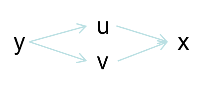
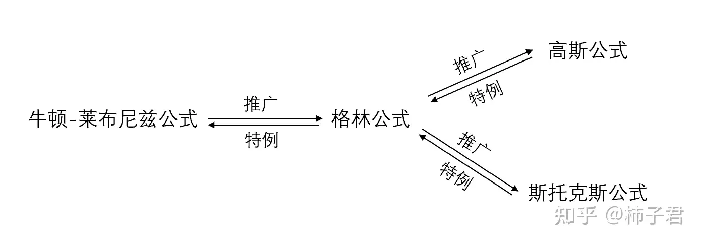

<h1 align="center">微积分二</h1>

最近更新时间：2023-12-9

## 多元函数

        **概念**：$Z$是关于$x、y$的**不止一个未知数**的函数。

        **意义**：表示空间中的平面方程：$Ax+By+CZ+D=0（A、B、C不全0）$

| 术语  | 说明       |
|:---:|:--------:|
| 领域  | 一个面      |
| 内点  | 平面方程线内点  |
| 边界点 | 平面方程线上点  |
| 定义域 | x和y的取值区间 |

---

### 二元函数极值

        **极值充分条件，判断过程**：

1. 求驻点：先求出$f_x'，f_y'$，令$f_x'＝0，f_y'＝0$求出所有驻点，(可能需要互套)

2. 求每个驻点的$B^2-AC$值
   
   | 字母  | 含义                 |
   |:---:|:------------------:|
   | $A$ | $f_{xx}'(x_0,y_0)$ |
   | $B$ | $f_{xy}'(x_0,y_0)$ |
   | $C$ | $f_{yy}'(x_0,y_0)$ |

3. 情况分析：
   
   | 情况         | 则为                        |
   |:----------:|:-------------------------:|
   | $B^2-AC<0$ | $A>0$**极小值**，$A<0$**极大值** |
   | $B^2-AC>0$ | 该驻点非极值点                   |
   | $B^2-AC=0$ | 无法判断                      |
   
   + 助记：先小后大的图像是极小值

 

        **极值判断捷径**：**直接配方**

 

| 二元函数最大值出现位置 |
|:-----------:|
| 极值（实际问题多为此） |
| 偏导不存在       |
| 定义域边界       |

---

### 拉格朗日常数法

        **概念**：将**有条件极值**转为**无条件极值**，通过增加变量为条件函数的系数，直接尾部挂入此条件来构造新函数。

        求$Z＝f(x,y)$在条件$g(x,y)＝0$的极值，则：

$$
L(x,y,\lambda)＝f(x,y)＋\lambda g(x,y)
$$

        求$Z＝f(x,y)$在条件$g(x,y)＝0$和$h(x,y)＝0$的极值，则：

$$
L(x,y,\lambda_1,\lambda_2)＝f(x,y)＋\lambda_1g(x,y)＋\lambda_2h(x,y)
$$

        结果就是求构造函数$L$的极值，即求所有未知数$x,y,\lambda_1,\lambda_2...$的偏导都为$0$的点。

---

## 二元连续

        **概念**：以任何方式向$(x_0,y_0)$逼进的极限都一样。

        **意义**：**不能有洞**，**可揉纸变形**

---

## 偏导数

        **概念**：函数$Z＝f(x,y)$中，$x_0$，$y_0$领域有定义，在$x_0$处变化$Δx$，在$y_0$处变化$Δy$

                    $x$的偏导为：$Δ_xZ＝f(x_0＋Δx，y_0)-f(x_0,y_0)$，$\lim_{Δx→0}\frac{Δ_xZ}{Δx}$

                    $y$的偏导为：$Δ_yZ＝f(x_0，y_0＋Δy)-f(x_0,y_0)$，$\lim_{Δy→0}\frac{Δ_yZ}{Δy}$

                    即**同时只有一个变量变化的导数**。(偏导存在不一定连续，只4方极限一样)

        **意义**：**切面曲线是光滑的**

        **公式**：对$x$求偏导，直接套用导数基本公式，把其他**非$x$的变量都看成是常数**。

| 四种表示法 | $f_x'(x_0,y_0)$ | $Z_x'\vert _{x=x_0,y=y_0}$ | $\frac{\partial f(x_0,y_0)}{\partial x}$ | $\frac{\partial Z}{\partial x}\vert _{x=x_0,y=y_0}$ |
|:-----:|:---------------:|:--------------------------:|:----------------------------------------:|:---------------------------------------------------:|

---

### 高阶偏导

| 高阶偏导表示 | $f_{xx}''(x_0,y_0)$ | $Z_{xx}''\vert_{x=x_0,y=y_0}$ | $\frac{\partial ^2f(x_0,y_0)}{\partial x^2}$ | $\frac{\partial^2 Z}{\partial x^2}\vert_{x=x_0,y=y_0}$ |
| ------ | ------------------- | ----------------------------- | -------------------------------------------- | ------------------------------------------------------ |

+ **混合高阶偏导**：$Z_{xy}$，$Z_{yx}$，当连续时：$Z_{xy}''=Z_{yx}''$

---

### 隐函数偏导

        在$Ax+By+CZ+D=0的隐函数中：$

1. 两边同时对$x$求偏导。

2. 含$Z$**项**看作是$x$的**复合函数**，其他**非$x$的变量都看作是常数**。

3. 最后写出$Z_x'$表达式。

---

### 多元复合偏导

例：有$y=f(u,v)，u=g(x)，v=t(x)$，具体示意图如下：

**一阶导**

$$
\frac{\partial y}{\partial x}=
\frac{\partial y}{\partial u}×
\frac{\partial u}{\partial x}+
\frac{\partial y}{\partial v}×
\frac{\partial v}{\partial x}
$$

- 每路复合偏导结果相加

**二阶导**

$$
\begin{align*}
\frac{\partial ^2y}{\partial x^2}
=&(\frac{\partial y}{\partial u}×
\frac{\partial u}{\partial x}+
\frac{\partial y}{\partial v}×
\frac{\partial v}{\partial x})'\\
=&(\frac{\partial^2 y}{\partial u^2}×\frac{\partial u}{\partial x}×
\frac{\partial u}{\partial x})+
(\frac{\partial y}{\partial u}×\frac{\partial^2 u}{\partial x^2})+
(\frac{\partial^2 y}{\partial v^2}×\frac{\partial v}{\partial x}×
\frac{\partial v}{\partial x})+
(\frac{\partial y}{\partial v}×\frac{\partial^2 v}{\partial x^2})
\end{align*}
$$

- **到谁偏导的路径，仍然其到谁加后续**，如下：
  
  $$
  \frac{\partial y}{\partial u}\to u \to x，
\frac{\partial y}{\partial v}\to v \to x，
\frac{\partial u}{\partial x}\to x，
\frac{\partial v}{\partial x}\to x
  $$

---

## 全微分

        **概念**：函数$Z＝f(x,y)$中，$x_0$，$y_0$领域有定义，$Δx≠0，Δx＋x_0∈x_0领域$，$Δy≠0，Δy＋y_0∈y_0领域$，那么在($x_0$,$y_0$)处有：

$$
\lim_{Δx→0,Δy→0}f(x_0+Δx,y_0+Δy)=f(x_0,y_0)+Z_x'Δx+Z_y'Δy\\
(x_0,y_0)处的微分表示为(纵轴变换量公式)：\\
dZ|_{(x_0,y_0)}=f(x_0+Δx,y_0+Δy)-f(x_0,y_0)=Z_x'Δx+Z_y'Δx
$$

                即要加上**全部微小变化×对应偏导**

        **意义**：做**近似计算**等对**偏导数的使用**。

---

## 二重积分

        **概念**：函数$Z＝f(x,y)$中，

$$
\lim_{ΔS_i\to0}\sum f(x,y)ΔS_i＝\iint_Df(x,y)d\sigma ＝\iint_D f(x,y)dxdy
$$

        **意义**：其中，$ΔS_i$为函数$Z$在$xoy$平面上投影$D$划分的无数个非常小的底面积，$f(x,y)$为高度，因此底面积×高就是**求体积**。

| 性质                                                              |
|:---------------------------------------------------------------:|
| $f(x,y)>0$二重积分数值为正，$f(x,y)<0$二重积分数值为负                           |
| 数乘内外提                                                           |
| 先加减后积分，先积分后加减                                                   |
| 若$f(x,y)≤g(x,y)$，则$\iint_D f(x,y)d\sigma≤\iint_D g(x,y)d\sigma$ |
| 介值性，若$m≤f(x,y)≤M$，则$mS_D≤\iint_D f(x,y)d\sigma≤MS_D$            |
| 二重积分中值定理：一定能在找到一点$f(x_0,y_0)S_D＝\iint_Df(x,y)d\sigma$           |

---

### 直接坐标系

        **X型积分**：

$$
\iint_Df(x,y)dxdy＝\int_{x左范围}^{x右范围}dx
\int_{关于x下函数}^{关于x上函数}f(x,y)dy
$$

        **Y型积分**：

$$
\iint_Df(x,y)dxdy＝\int_{y下范围}^{y上范围}dy
\int_{关于y左函数}^{关于y右函数}f(x,y)dx
$$

| 性质                                    |
|:-------------------------------------:|
| 积不相关的变量，可当常量往前提                       |
| X型积分和Y型积分的复杂程度不一样，X型积分和Y型积分有时候有一个不能积分 |
| $\iint_D1dxdy＝S_D$                    |

---

### 极坐标系\换元法

| 极坐标      | 说明              | 取值范围          |
|:--------:|:---------------:|:-------------:|
| r        | 从原点出发的射线长度      | $[0,+\infty)$ |
| $\theta$ | 射线从$x$轴向y轴旋转的度数 | $[0,2π]$      |

**例1——原点圆**：$D$为：$x^2＋y^2＝4$，求$\iint_{D} f(x,y)dxdy$

1. **直接坐标系转极坐标系（换元）**：$x=r\cos\theta，y=r\sin\theta$

2. **雅可比行列式**：

$$
J\frac{\partial(x,y)}{\partial(r,\theta)}=
\left \vert
\begin{array}{cccc} 
\frac{\partial x}{\partial r}  &  \frac{\partial x}{\partial \theta}\\
\\
\frac{\partial y}{\partial r}  &  \frac{\partial y}{\partial \theta}\\ 
\end{array}
\right\vert=
\left \vert
\begin{array}{cccc} 
\cos\theta  &  -r\sin\theta\\
\\
\sin\theta  &  r\cos\theta\\ 
\end{array}
\right\vert=r\cos^2\theta+r\sin^2\theta=r
$$

3. $D$**对应为**：$r^2=4，即半径为2的圆$
   
   被积$f(x,y)$**对应为**：$f(r\cos\theta，r\sin\theta)J(r,\theta)=f(r\cos\theta，r\sin\theta)r$

$$
\begin{align*}
\iint_Df(x,y)dxdy=&
\iint_{角度起}^{角度终}d\theta
\iint_{长度起}^{长度终}f(r\cos\theta，r\sin\theta)rdr\\
=&\iint_{0}^{2π}d\theta
\iint_{0}^{2}f(r\cos\theta，r\sin\theta)rdr
\end{align*}
$$

+ 极坐标系只有**角度型积分**

---

**例2——非原点圆**：$D$为：$(x-1)^2＋(y-2)^2＝4$，求$\iint_{D} f(x,y)dxdy$

1. **换元**：$u=x-1，v=y-2$

2. **雅可比行列式**：$x=u+1，y=v+2$
   
   $$
   J\frac{\partial(x,y)}{\partial(u,v)}=
\left\vert
\begin{array}{cccc} 
\frac{\partial x}{\partial u}  &  \frac{\partial x}{\partial v}\\
\\
\frac{\partial y}{\partial u}  &  \frac{\partial y}{\partial v}\\ 
\end{array}
\right\vert=
\left\vert
\begin{array}{cccc} 
1  &  0\\
\\
0  &  1\\ 
\end{array}
\right\vert=1
   $$

3. $D$**对应为**：$u^2+v^2=4$
   
   被积$f(x,y)$**对应为**：$f(u+1,v+2)×1$

4. **二次换元转极坐标**：略

---

**例3——原点椭圆**：$D$为：$\frac{x^2}{a^2}＋\frac{y^2}{b^2}＝1$，求$\iint_{D} f(x,y)dxdy$

1. **直接坐标系转极坐标系（换元）**：$x=ar\cos\theta，y=br\sin\theta$

2. **雅可比行列式**：
   
   $$
   J\frac{\partial(x,y)}{\partial(r,\theta)}=
\left\vert
\begin{array}{cccc} 
\frac{\partial x}{\partial r}  &  \frac{\partial x}{\partial \theta}\\
\\
\frac{\partial y}{\partial r}  &  \frac{\partial y}{\partial \theta}\\ 
\end{array}
\right\vert=
\left\vert
\begin{array}{cccc} 
a\cos\theta  &  -ar\sin\theta\\
\\
b\sin\theta  &  br\cos\theta\\ 
\end{array}
\right\vert=abr
   $$

3. $D$**对应为**：$r^2=1，即半径为1的圆$
   
   被积$f(x,y)$**对应为**：$f(ar\cos\theta,br\sin\theta)×abr$

---

### 旋转体的体积和表面积

| 概念  | 公式                                     | 解释              |
|:---:|:--------------------------------------:|:---------------:|
| 体积  | $2\pi\iint_{被旋转区域D}{区域每点到旋转轴的距离r}dxdy$ | 区域**积旋转周长**得体积  |
| 表面积 | $2\pi\iint_{被旋转线段L}{区域每点到旋转轴的距离r}ds$   | 线段**积旋转周长得**表面积 |

+ 上述公式的**前提**：被旋转的对象不可穿过旋转轴

+ $ds=\sqrt{1+{y'}^2}dx=\sqrt{{x_t'}^2+{y_t'}^2}dt$，即**曲线长公式**
  
  $$
  \begin{align*}
由勾股定理得线段微分&ds^2=dx^2+dy^2①\\
&y'=\frac{dy}{dx},dy=y'dx②\\
②代入①得&ds^2=dx^2+(y'dx)^2\\
化简得&ds=\sqrt{1+{y'}^2}dx\\
&x_t'=\frac{dx}{dt},dx=x_t'dt③\\
&y_t'=\frac{dy}{dt},dy=y_t'dt④\\
③④代入①得&ds^2=(x_t'dt)^2+(y_t'dt)^2\\
化简得&ds=\sqrt{{x_t'}^2+{y_t'}^2}dt\\
\end{align*}
  $$

---

## 三重积分

        **概念**：函数$Z=f(x,y)$中，其对应的密度函数$Q=g(x,y,z)$

$$
\lim_{ΔV_i\to 0}\sum g(x,y,z)ΔV_i＝
\iiint_\Omega g(x,y,z)dV＝
\iiint_\Omega g(x,y)dxdydz
$$

        **意义**：其中，$ΔV_i$为函数$Z$对应空间$\Omega$划分的无数个非常小的体积，$g(x,y,z)$为对应密度，因此体积×密度就是**求质量**。

---

### 直接坐标系

**先一后二投影法**：如XOY投影型可得到投影面$D_{xy}$，由投影面$D_{xy}$逆方向发射激光，以其通过两点所在的面为$dz$的下限和上限，然后$dxdy$再依据投影面$D_{xy}$和二重积分确定上下限。

        **XOY投影型+二重积分X型**：

$$
\begin{align*}
& \iiint_\Omega g(x,y,z)dxdydz \\
=& \iint_{Dxy}dxdy\int_{z=含x,y的下限}^{z=含x,y的上限}g(x,y,z)dz\\
=& \int_{x下限}^{x上限}dx
\int_{y=含x的下限}^{y=含x的上限}dy
\int_{z=含x,y的下限}^{z=含x,y的上限}g(x,y,z)dz
\end{align*}
$$

        **XOY投影型+二重积分Y型**：

$$
\begin{align*}
&\iiint_\Omega g(x,y,z)dxdydz\\
=&\iint_{Dxy}dxdy
\int_{z=含x,y的下限}^{z=含x,y的上限}g(x,y,z)dz\\
=&\int_{y下限}^{y上限}dy
\int_{x=含y的下限}^{x=含y的上限}dx
\int_{z=含x,y的下限}^{z=含x,y的上限}g(x,y,z)dz
\end{align*}
$$

        **YOZ投影型、XOZ投影型**：同理，少用略

| 性质                               |
|:--------------------------------:|
| 积不相关的变量，可当常量往前提                  |
| 该激光必须只能经过2个点，该投影型才能积。            |
| $\iiint_\Omega 1dxdydz＝V_\Omega$ |

---

**先二后一切割法**：如Z切割型直接确定Z的积分上下限范围，上下限都是常数，而后半部分先积分的二重积分是对应为一个个不同切割面。

        **Z切割型**：

$$
\begin{align*}
& \iiint_\Omega g(x,y,z)dxdydz \\
=& \int_{z下限}^{z上限}dz\iint_Dg(x,y,z)dxdy\\
&若g(x,y,z)=g_2(z)，且每个面的面积公式相同，则提前，直接求解\\
=& \int_{z下限}^{z上限}g_2(z)dz\iint_D1dxdy\\
=& \int_{z下限}^{z上限}g_2(z)S_Ddz\\
&若g(x,y,z)≠g_2(z)，则把z看作是常数，老老实实进行dxdy的二重积分
\end{align*}
$$

---

### 极坐标系\换元法

| 极坐标      | 说明              | 取值范围          |
|:--------:|:---------------:|:-------------:|
| r        | 从原点出发的射线长度      | $[0,+\infty)$ |
| $\phi$   | 射线与$z$轴的夹角      | $[0,π]$       |
| $\theta$ | 射线从$x$轴向y轴旋转的度数 | $[0,2π]$      |

+ $r=4$时为球面、$\theta=4$时为半平面，$\phi=4$时为圆锥面

**例1：柱面坐标，圆截面**：$\Omega$为：$x^2＋y^2＝z，z≤4$，求$\iiint_{\Omega} g(x,y,z)dxdydz$

1. **换元**：$x=r\cos\theta，y=r\sin\theta，z=z$

2. **三阶雅可比行列式**：

$$
J\frac{\partial(x,y,z)}{\partial(r,\theta,z)}=
\left\vert
\begin{array}{cccc} 
\frac{\partial x}{\partial r}
&\frac{\partial x}{\partial \theta}
&\frac{\partial x}{\partial z}
\\
\\
\frac{\partial y}{\partial r}
&\frac{\partial y}{\partial \theta}
&\frac{\partial y}{\partial z}
\\ 
\\
\frac{\partial z}{\partial r}
&\frac{\partial z}{\partial \theta}
&\frac{\partial z}{\partial z}
\end{array}
\right\vert=
\left\vert
\begin{array}{cccc} 
\cos\theta  &  -r\sin\theta  &  0
\\
\\
\sin\theta  &  r\cos\theta  &  0
\\
\\0  &  0  &  1
\end{array}
\right\vert=r
$$

3. $\Omega$**对应为**：$r^2=z，z≤4$
   
   被积$g(x,y,z)$**对应为**：$g(r,\theta,z)J(r,\theta,z)=g(r,\theta,z)r$

$$
\begin{align*}
&\iiint_{\Omega} g(x,y,z)dxdydz\\
=&\iiint_{\Omega} g(x,y,z)rdrd\theta dz\\
运用XOY投影型=&\iint_{Dxy}drd\theta\int_{r^2}^4g(z,y,z)dz\\
=&\int_{0}^{2\pi}\int_0^2drd\theta\int_{r^2}^4g(z,y,z)dz
\end{align*}
$$

---

**例2：柱面坐标，椭圆截面**：$\Omega$为：$\frac{x^2}{a^2}＋\frac{y^2}{b^2}＝z，z≤4$，求$\iiint_{\Omega} g(x,y,z)dxdydz$

1. **换元**：$x=ar\cos\theta，y=br\sin\theta，z=0$

2. **三阶雅可比行列式**：
   
   $$
   J\frac{\partial(x,y,z)}{\partial(r,\theta,z)}=
\left\vert
\begin{array}{cccc} 
\frac{\partial x}{\partial r}
&\frac{\partial x}{\partial \theta}
&\frac{\partial x}{\partial z}
\\
\\
\frac{\partial y}{\partial r}
&\frac{\partial y}{\partial \theta}
&\frac{\partial y}{\partial z}
\\ 
\\
\frac{\partial z}{\partial r}
&\frac{\partial z}{\partial \theta}
&\frac{\partial z}{\partial z}
\end{array}
\right\vert=
\left\vert
\begin{array}{cccc} 
a\cos\theta  &  -ar\sin\theta  &  0
\\
\\
b\sin\theta  &  br\cos\theta  &  0
\\
\\0  &  0  &  1
\end{array}
\right\vert=abr
   $$

3. $\Omega$**对应为**：$r^2=z，z≤4$
   
   被积$g(x,y,z)$**对应为**：$g(r,\theta,z)J(r,\theta,z)=g(r,\theta,z)abr$

---

**例3：球面坐标**：$\Omega为：x^2＋y^2+z^2=4，求\iiint_{\Omega} g(x,y,z)dxdydz$

1. **换元**：$x=r\sin\phi\cos\theta，y=r\sin\phi\sin\theta，z=r\cos\phi$

2. **三阶雅可比行列式**：
   
   $$
   J\frac{\partial(x,y,z)}{\partial(r,\phi,\theta)}=
\left\vert
\begin{array}{cccc} 
\frac{\partial x}{\partial r}
&\frac{\partial x}{\partial \phi}
&\frac{\partial x}{\partial \theta}
\\
\\
\frac{\partial y}{\partial r}
&\frac{\partial y}{\partial \phi}
&\frac{\partial y}{\partial \theta}
\\ 
\\
\frac{\partial z}{\partial r}
&\frac{\partial z}{\partial \phi}
&\frac{\partial z}{\partial \theta}
\end{array}
\right\vert=
\left\vert
\begin{array}{cccc} 
\sin\phi\cos\theta  &  r\cos\phi\cos\theta  &  -r\sin\phi\sin\theta
\\
\\
\sin\phi\sin\theta  &  r\cos\phi\sin\theta  &  r\sin\phi\cos\theta
\\
\\\cos\phi  &  -r\sin\phi  &  0
\end{array}
\right\vert=r^2\sin\phi
   $$

3. $\Omega$**对应为**：$r^2=4$
   
   被积$g(x,y,z)$**对应为**：$g(r,\phi,\theta)J(r,\phi,\theta)=g(r,\phi,\theta)r^2\sin\phi$

---

**例4：橄榄球面坐标**：$\Omega为：\frac{x^2}{a^2}＋\frac{y^2}{b^2}+\frac{z^2}{c^2}=4，求\iiint_{\Omega} g(x,y,z)dxdydz$

1. **换元**：$x=ar\sin\phi\cos\theta，y=br\sin\phi\sin\theta，z=cr\cos\phi$

2. **三阶雅可比行列式**：
   
   $$
   J\frac{\partial(x,y,z)}{\partial(r,\phi,\theta)}=
\left\vert
\begin{array}{cccc} 
\frac{\partial x}{\partial r}
&\frac{\partial x}{\partial \phi}
&\frac{\partial x}{\partial \theta}
\\
\\
\frac{\partial y}{\partial r}
&\frac{\partial y}{\partial \phi}
&\frac{\partial y}{\partial \theta}
\\ 
\\
\frac{\partial z}{\partial r}
&\frac{\partial z}{\partial \phi}
&\frac{\partial z}{\partial \theta}
\end{array}
\right\vert=
\left\vert
\begin{array}{cccc} 
a\sin\phi\cos\theta  &  ar\cos\phi\cos\theta  &  -ar\sin\phi\sin\theta
\\
\\
b\sin\phi\sin\theta  &  br\cos\phi\sin\theta  &  br\sin\phi\cos\theta
\\
\\c\cos\phi  &  -cr\sin\phi  &  0
\end{array}
\right\vert=abcr^2\sin\phi
   $$

3. $\Omega$**对应为**：$r^2=4$
   
   被积$g(x,y,z)$**对应为**：$g(r,\phi,\theta)J(r,\phi,\theta)=g(r,\phi,\theta)abcr^2\sin\phi$

---

### 常见函数图形

| 函数                                                  | 类别   | 图形                      |
|:---------------------------------------------------:|:----:|:-----------------------:|
| $x^2＋y^2＝r^2$                                       | 圆    | 圆心(0,0)                 |
| $(x-3)^2＋（y-5)^2＝r^2$                               | 圆    | 圆心(3,5)                 |
| $\frac{x^2}{a^2}＋\frac{y^2}{b^2}＝1$                 | 椭圆   | 圆心(0,0)，对称轴x轴、y轴        |
| $\frac{(x-3)^2}{a^2}＋\frac{(y-5)^2}{b^2}＝1$         | 椭圆   | 圆心(3,5)，对称轴x轴、y轴        |
| $x^2＋y^2-xy＝4$                                      | 椭圆   | 圆心(0,0)，对称轴y=x、y=-x，大小4 |
| $x^2＋y^2＝1，0≤z≤4$                                   | 柱面坐标 | 圆柱                      |
| [$x^2＋y^2＝z，0≤z≤4$]()                               | 柱面坐标 | 圆锥                      |
| $\frac{x^2}{a^2}＋\frac{y^2}{b^2}＝z，0≤z≤4$           | 柱面坐标 | 椭圆锥                     |
| $x^2＋y^2+z^2=r^2$                                   | 球面坐标 | 球                       |
| $\frac{x^2}{a^2}＋\frac{y^2}{b^2}+\frac{z^2}{c^2}=1$ | 球面坐标 | 橄榄球                     |
| $\frac{x^2}{a^2}-\frac{y^2}{b^2}＝1$                 | 双曲线  | ) (                     |
| $y=\frac{k}{x}$                                     | 双曲线  | 一三象限                    |
| $y=\frac{k}{x}+ax$                                  | 双曲线  | 一三象限，对钩函数，渐近线y=ax       |

## 积分关系定理

**格林公式**：若函数$P，Q$在**闭平面区间**$D$上连续，且有一阶偏导，$L$为$D$的**边界曲线**并取正向，则有**曲线积分<=>二重积分**

$$
\oint_L Pdx+Qdy
=\iint_D(\frac{\partial Q}{\partial x}-\frac{\partial P}{\partial y})dxdy\\
若曲线积分与L无关，则\frac{\partial Q}{\partial x}=\frac{\partial P}{\partial y}
$$

**高斯公式**：若函数$P，Q，R$在**闭空间区间**$\Omega$上连续，且有一阶偏导，$D$为$\Omega$的**边界曲面**，则有**曲面积分<=>三重积分**

$$
\oiint_DPdxdy+Qdydz+Rdxdz=\iiint_\Omega
(\frac{\partial P}{\partial z}+
\frac{\partial Q}{\partial x}+
\frac{\partial R}{\partial y})dxdydz
$$

**斯托克斯公式**：若函数$P，Q，R$在**闭平面区间**D上连续，且有一阶偏导，$L$为$D$的**边界曲线**，D的正法方向量与L的正方向按右手法则，则有**曲线积分<=>曲面积分**

$$
\oint_L Pdx+Qdy+Rdz
=\oiint_D(\frac{\partial Q}{\partial x}-\frac{\partial P}{\partial y})dxdy
+(\frac{\partial R}{\partial y}-\frac{\partial Q}{\partial z})dydz
+(\frac{\partial P}{\partial z}-\frac{\partial R}{\partial x})dzdx
$$

---

**各积分的关系**

**各积分的转换**

---

## 总结归纳

### 主术语

| 多元主术语 | 多元意义          | 对应一元意义     | 对应一元主术语 |
|:-----:|:-------------:|:----------:|:-------:|
| 二元连续  | 纸可揉，不能破洞      | 一笔画        | 一元连续    |
| 偏导数   | 某方向切线斜率，光滑    | 切线斜率，光滑    | 导数      |
| 全微分   | 利用全部偏导数，做近似计算 | 利用导数，做近似计算 | 微分      |
| 二重积分  | 由面，积高，求体积     | 由线，积高，求面积  | 积分      |
| 三重积分  | 由体积，积密度，求质量   | \          | \       |

---

## 无穷级数

| 级数      | 概念                                     | 收敛                                                                         | 发散                                             |
|:-------:|:--------------------------------------:|:--------------------------------------------------------------------------:|:----------------------------------------------:|
| 等比级数    | \                                      | $\vert q\vert<1$时$\lim_{n\to\infty}\frac{a_1(1-q^n)}{1-q}=\frac{a_1}{1-q}$ | $\vert q\vert>1$                               |
| 裂项相消    | $\sum_{n=1}^\infty\frac{1}{n(n+1)}$    | $\lim_{n\to\infty}1-\frac{1}{n+1}=1$                                       | \                                              |
| $\ln$相消 | $\sum_{n=1}^\infty\ln\frac{n+1}n$      | \                                                                          | $\lim_{n\to\infty}n+1=\infty$                  |
| 调和级数    | $\sum_{n=1}^\infty\frac{1}{n}$         | \                                                                          | $≥\lim_{n\to\infty}\int_1^{+\infty}\frac 1xdx$ |
| P级数     | $\sum_{n=1}^\infty\frac{1}{n^p}$       | $p>1$                                                                      | $p<1$                                          |
| 交错P级数   | $\sum_{n=1}^\infty(-1)^n\frac{1}{n^p}$ | $p≥1$，绝对收敛； $p<1$，条件收敛                                                  | \                                              |

+ $\ln$公式：$\ln a-\ln b=\ln\frac ab，\ln a+\ln b=\ln ab$

| 收敛保持运算、性质                    |
|:----------------------------:|
| 收敛通项数乘，仍然收敛（同广义积分）           |
| 收敛通项±收敛通项，仍然收敛 （同广义积分）       |
| 收敛级数，任加括号仍然收敛。发散级数，任去括号后仍然发散 |
| 收敛的必要不充分条件是：通项趋于0            |
| 收敛通项＋发散通项，必发散                |
| 发散通项＋发散通项，未必发散               |
| 若\|通项\|收敛，则原通项收敛（同广义积分）      |
| 若原列收敛，则子列收敛，且所有子列收敛一样        |
| （逆否命题）若子列发散，或两个子列收敛不同，则原列发散。 |

---

### 正项级数

        **概**念：全部通项≥0

        **性质**：收敛<=>求和函数有界

| 判断方法      | 说明                                                                                           |
|:---------:|:--------------------------------------------------------------------------------------------:|
| 比较判别法（夹逼） | 0≤通项≤收敛通项，通项收敛； 通项≥发散通项，通项发散。                                                             |
| 比较判别法（除法） | $\lim_{n\to+\infty}\frac{通项}{收敛通项}=0$，通项收敛；$\lim_{n\to+\infty}\frac{通项}{发散通项}=+\infty$，通项发散。 |
| 比值判别法     | $\lim_{n\to\infty}\frac{a_{n＋1}}{a_n}＝L$，$L>1$发散，$L<1$收敛，$L=1$无法判                            |
| 根值判别法     | $\lim_{n\to\infty}\sqrt[n]{a_n}＝P$，$P>1$发散，$P<1$收敛，$P=1$无法判                                  |

---

### 交错级数

        **概念**：通项正负交替出现

| 判断方法 | 说明                              |
|:----:|:-------------------------------:|
| 莱布尼茨 | 通项趋于0，且$a_n≥a_{n+1}$即级数单调不增，则收敛 |

+ $a_n$与$a_{n+1}$比较的三种方法：相减、相除、求导

| 收敛分类 | 说明              |
| ---- |:---------------:|
| 绝对收敛 | 通项收敛，且\|通项\|也收敛 |
| 条件收敛 | 通项收敛，但\|通项\|不收敛 |

+ 绝对收敛性质：两个绝对收敛通项相乘，仍然收敛。

---

### 幂级数

        **概念**：$a_0＋a_1x＋a_2x^2＋...＋a_nx^n$

        **判别方法**：全部取绝对值，然后用比值判别法

$$
\begin{align*}
&\lim_{n\to\infty}\vert\frac{u_{n+1}}{u_n}\vert
=\lim_{n\to\infty}\vert\frac{a_{n+1}}{a_n}x\vert=L\\
&因为L<1收敛，有如下情况：\\
&①若\vert\frac{a_{n+1}}{a_n}\vert=0，
x∈(-\infty,+\infty)，x收敛半径+\infty\\
&②若\vert\frac{a_{n+1}}{a_n}\vert=Q∈(0，+\infty)，
x∈(-\frac{1}{Q},\frac{1}{Q}),x收敛半径\frac{1}{Q}\\
&③若\vert\frac{a_{n+1}}{a_n}\vert=+\infty，
x=0，x收敛半径0\\
&最后，单独判断L=1的情况
\end{align*}
$$

| 性质                                   |
|:------------------------------------:|
| 两个幂级数通项相加，收敛半径取最小                    |
| $S(x)$在$x$的收敛域内是连续的                  |
| 幂级数通项求导后，收敛域不变，端点需要重新判断              |
| 幂级数通项求积分后，收敛域不变，端点需要重新判断             |
| 幂级数求和：先导后积（可能联系到微分方程，求系数重要点$S(0)=0$） |
| 幂级数求和：凑等比为$x、-x$                     |

---

### 傅里叶级数

        **概念**：用级数拟合周期函数，若$f(x)$是周期函数，周期为$T=2l$，则通用公式：

$$
f(x)=\frac{a_0}{2}+\sum_{n=1}^{\infty}
(a_n\cos\frac{n\pi x}l+b_n\sin\frac{n\pi x}l)\\
a_n=\frac1l\int_{-l}^lf(x)\cos\frac{n\pi x}ldx（n=1,2,3...）\\
b_n=\frac1l\int_{-l}^lf(x)\sin\frac{n\pi x}ldx（n=1,2,3...）
$$

若$f(x)$为偶函数，则系数为：

$$
a_n=\frac2l\int_{0}^lf(x)\cos\frac{n\pi x}ldx（n=1,2,3...）\\
b_n=0
$$

若$f(x)$为奇函数，则系数为：

$$
a_n=0\\
b_n=\frac2l\int_{0}^lf(x)\sin\frac{n\pi x}ldx（n=1,2,3...）
$$

**傅里叶级数求和**，为**狄利克雷收敛**定理：

1. 连续处：$S(n)=f(n)$

2. 间断处：$S(n)＝x为n左右f(n)极限均值$

---

## 微分方程

        **概念**：含有导数或微分的方程

| 分类     | 说明                |
|:------:|:-----------------:|
| 常微分方程  | 含一元函数的导数，又分为一阶、高阶 |
| 偏导微分方程 | 含多元函数的偏导数（本科略）    |

---

### 一阶常微分方程

| 分类                       | 说明                                                 |
|:------------------------:|:--------------------------------------------------:|
| 可分离$y'$的，等式右边不包含$y$      | 直接求不定积分得$y$                                        |
| 令$y'=\frac{dy}{dx}$      | 化为$f(x)dx=f(y)dy$，两边同时积分                           |
| 一阶线性（齐次）$y'＋p(x)y＝0$     | $y＝Ce^{-\int p(x)dx}$                              |
| 一阶线性（非齐次）$y'＋p(x)y＝q(x)$ | $y＝(\int q(x)e^{\int p(x)dx}dx＋C)e^{-\int p(x)dx}$ |

+ 一阶线性微分方程解的推演：$(UV)'=U'V+UV'$

---

### 高阶常微分方程

| 分类                            | 说明                                                                                                                  |
|:-----------------------------:|:-------------------------------------------------------------------------------------------------------------------:|
| 可分离$y^{(n)}$的                 | 直接多次求不定积分得$y$                                                                                                       |
| 二阶线性常系数（齐次） $y''＋py'＋qy＝0$ | **构造特征方程**，$r^2＋pr＋q＝0$ Δ>0时，解为$r_1，r_2$ $y＝C_1e^{r_1x}＋C_2e^{r_2x}$ Δ=0时，解为$r$ $y＝C_1e^{rx}＋C_2e^{rx}$ |
| 二阶线性常系数（非齐次）$y''＋py'＋qy＝f(x)$ | 齐次解+特解                                                                                                              |
| 欧拉方程$x^2y''＋xpy'＋qy＝f(x)$     | 换元$x=e^t，t=lnx$，则$x^2y''=y_t''-y_t'，xy'=y_t'$，得到y关于t的二阶线性常系数（非齐次）                                                   |

---

## 差分方程

        **概念**：离散函数中，后一个数减去前一个数的构成的方程是一阶差分，一阶减一阶是二阶差分。

| 分类                         | 说明              |
|:--------------------------:|:---------------:|
| 一阶线性齐次$y_{t＋1}＋ay_t＝0$     | $y_t＝y_0(-a)^t$ |
| 一阶线性非齐次$y_{t＋1}＋ay_t＝f(x)$ | 齐次解+特解          |

---

## 平面方程

| 术语   | 二维                                                                                                                        | 三维                                                                                                                                                                                                                                   |
|:----:|:-------------------------------------------------------------------------------------------------------------------------:|:------------------------------------------------------------------------------------------------------------------------------------------------------------------------------------------------------------------------------------:|
| 平面方程 | $f(x,y)=0$                                                                                                                | $f(x,y,z)=0$                                                                                                                                                                                                                         |
| 切点   | $(x_0,y_0)$                                                                                                               | $(x_0,y_0,z_0)$                                                                                                                                                                                                                      |
| 法向量  | $(f_x'，f_y')\vert_{(x_0,y_0)}$                                                                                            | $(f_x'，f_y'，f_z')\vert_{(x_0,y_0,z_0)}$                                                                                                                                                                                              |
| 切方程  | 切线方程$f_x'(x-x_0)＋f_y'(y-y_0)＝0$                                                                                           | 切平面方程$f_x'(x-x_0)＋f_y'(y-y_0)＋f_z'(z-z_0)＝0$                                                                                                                                                                                         |
| 法线   | $\frac{x-x_0}{f_x'}=\frac{y-y_0}{f_y'}$                                                                                   | $\frac{x-x_0}{f_x'}=\frac{y-y_0}{f_y'}=\frac{z-z_0}{f_z'}$                                                                                                                                                                           |
| \    | \                                                                                                                         | \                                                                                                                                                                                                                                    |
| 方向向量 | $l=(i,j)$                                                                                                                 | $l=(i,j,k)$                                                                                                                                                                                                                          |
| 向量长度 | $\|l\|=\sqrt{i^2＋j^2}$                                                                                                    | $\|l\|=\sqrt{i^2＋j^2＋k^2}$                                                                                                                                                                                                           |
| 方向余弦 | $(\cos\alpha,\cos\beta)=(\frac{i}{\|l\|},\frac{j}{\|l\|})$                                                                | $(\cos\alpha,\cos\beta,\cos\gamma)=(\frac{i}{\|l\|},\frac{j}{\|l\|},\frac{k}{\|l\|})$                                                                                                                                                |
| 方向导数 | $(f_x'，f_y')·(\cos\alpha,\cos\beta)$                                                                                      | $(f_x'，f_y'，f_z')·(\cos\alpha,\cos\beta,\cos\gamma)$                                                                                                                                                                                 |
| \    | \                                                                                                                         | \                                                                                                                                                                                                                                    |
| 封闭区域 | $D$是$f(x,y)$围成的封闭区域                                                                                                       | $\Omega$是$f(x,y,z)$围成的封闭区域                                                                                                                                                                                                           |
| 密度函数 | $\rho(x,y)$                                                                                                               | $\rho(x,y,z)$                                                                                                                                                                                                                        |
| 形心   | $(\frac{\iint_Dxd\sigma}{\iint_D1d\sigma},\frac{\iint_Dyd\sigma}{\iint_D1d\sigma})$                                       | $(\frac{\iiint_\Omega xd\sigma}{\iiint_\Omega 1d\sigma},\frac{\iiint_\Omega yd\sigma}{\iiint_\Omega 1d\sigma},\frac{\iiint_\Omega zd\sigma}{\iiint_\Omega 1d\sigma})$                                                                |
| 质心   | $(\frac{\iint_Dx\rho(x,y) d\sigma}{\iint_D\rho(x,y) d\sigma},\frac{\iint_Dy\rho(x,y) d\sigma}{\iint_D\rho(x,y) d\sigma})$ | $(\frac{\iiint_\Omega x\rho(x,y,z)d\sigma}{\iiint_\Omega \rho(x,y,z)d\sigma},\frac{\iiint_\Omega y\rho(x,y,z)d\sigma}{\iiint_\Omega \rho(x,y,z)d\sigma},\frac{\iiint_\Omega z\rho(x,y,z)d\sigma}{\iiint_\Omega \rho(x,y,z)d\sigma})$ |
| 面积   | $\iint_D1d\sigma$                                                                                                         | \                                                                                                                                                                                                                                    |
| 体积   | \                                                                                                                         | $\iiint_\Omega 1d\sigma$                                                                                                                                                                                                             |
| 弧长   | $\int_{于x的投影}\sqrt{1+(y_x')^2}dx$                                                                                         | \                                                                                                                                                                                                                                    |
| 表面积  | \                                                                                                                         | $\iint_{于xoy的投影面}\sqrt{1+(z_x')^2+(z_y')^2}dxdy$                                                                                                                                                                                     |

+ **法向量**是对于**某切点**的概念。

+ **法向量**可以求**法线、切方程、方向导数**。

+ **两点间的距离公式**：$\sqrt{(x_1-x_2)^2＋(y_1-y_2)^2+(z_1-z_2)^2}$

+ **方向导数含未知数最大值时：法向量平行于方向余弦。**

---

## 三角公式

### 积化和差

$\sin a\cos b=\frac{\sin(a+b)+\sin(a-b)}2$

$\cos a\sin b=\frac{\sin(a+b)-\sin(a-b)}2$

$\cos a\cos b=\frac{\cos(a+b)+\cos(a-b)}2$

$\sin a\sin b=-\frac{\cos(a+b)-\cos(a-b)}2$

助记：积化和差，有和有差，相同不筛，不同筛，同头正，异头负，sinsin前负

### 和差化积（积化和差推导）

$\sin a+\sin b=2\sin\frac{a+b}{2}\cos\frac{a-b}{2}$

$\sin a-\sin b=2\cos\frac{a+b}{2}\sin\frac{a-b}{2}$

$\cos a+\cos b=2\cos\frac{a+b}{2}\cos\frac{a-b}{2}$

$\cos a-\cos b=-2\sin\frac{a+b}{2}\sin\frac{a-b}{2}$

### 降幂公式（积化和差推导）

$\sin^2a=-\frac{\cos(2a)-\cos(0)}2=\frac{1-\cos(2a)}2$

$\cos^2a=\frac{\cos(2a)+\cos(0)}2=\frac{1+\cos(2a)}2$

$\tan^2a=\frac{sin^2a}{cos^2a}=\frac{1-\cos(2a)}{1+\cos(2a)}$

### 平方转换

$\sin^2a+cos^2a=1$

$1+\tan^2a=\sec^2a$

$1+\cot^2a=\csc^2a$

---

## 向量旋度、散度公式

向量$A(x,y,z)=Pi+Qj+Rk$，其中$P、Q、R$为函数可偏导，则有$A$的**旋度**为按第一行代数余子式展开：

$$
rotA=
\left |
\begin{array}{cccc}
i & j & k\\
\frac{\partial }{\partial x} &
\frac{\partial }{\partial y} &
\frac{\partial }{\partial z}\\
P & Q & R
\end{array}
\right |=
(\frac{\partial R}{\partial y}-\frac{\partial Q}{\partial z})i-
(\frac{\partial R}{\partial x}-\frac{\partial P}{\partial z})j+
(\frac{\partial Q}{\partial x}-\frac{\partial P}{\partial y})k
$$

向量$A$的**散度**为：

$$
divA=\frac{\partial P}{\partial x}+\frac{\partial Q}{\partial y}+\frac{\partial R}{\partial z}
$$
